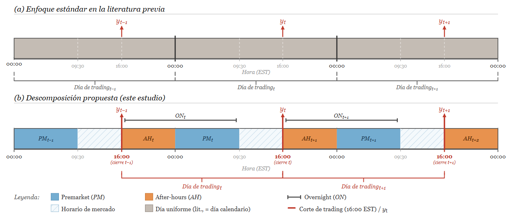

```{r setup, include=FALSE}
options(kableExtra.latex.load_packages = FALSE)
knitr::opts_chunk$set(
  echo = FALSE, warning = FALSE, message = FALSE,
  fig.align = "center", fig.pos = "H", out.extra = "",
  fig.width = 6.5, fig.height = 7,
  out.width = "100%",
  dev = "png", dpi = 300
)
```

# 1. Introducción

Con el auge de las redes sociales y su implicación en un sinfín de materias en las últimas dos décadas, los mercados financieros no han sido una excepción. Hace años que ha habido un incremento sustancial en la cantidad de texto financiero publicado por inversores minoristas en diversas plataformas como Reddit, StockTwits, X (antes Twitter) o Yahoo Finance \cite{Cookson2020,Bradley2024}; siendo el episodio con mayor impacto mediático el que sucedió con GameStop en enero de 2021, donde una comunidad del foro de Reddit (r/WallStreetBets) consiguió que mediante la interacción entre usuarios se diese un *short squeeze* histórico que provocó cambios drásticos en el mercado \cite{Pedersen2022,Mancini2022}. Este evento evidenció cómo las publicaciones de inversores minoristas dentro de una comunidad online pueden preceder a un impacto verdaderamente tangible en el mercado \cite{Anand2022} y, por ello, una cuestión que se puede plantear es si en todo el resto del océano de información publicada en diversos medios existe verdaderamente capacidad predictiva o si no es más que mero ruido \cite{Antweiler2004}.

Esta cuestión no es innovadora en la literatura, ya que existe una línea de investigación dedicada a ella desde hace décadas y que se inició con el análisis de medios más tradicionales como columnas del Wall Street Journal \cite{Tetlock2007,Tetlock2008}. En estas investigaciones los autores hallaron evidencia de que el tono de las noticias posee capacidad predictiva sobre retornos a corto plazo, sobre todo durante épocas de recesión \cite{Garcia2013}; además de observar cómo los comentarios negativos parecen tener un efecto más persistente que los positivos \cite{Heston2017}.

Dentro de las investigaciones más recientes se hallan las que se centran en redes sociales, donde se encontraron indicios de que los comentarios en estas plataformas podía predecir retornos, volatilidad y volumen de negociación \cite{Bollen2011,Bartov2018,Renault2017}. De todas formas, la evidencia es bastante heterogénea: donde algunos reportan alta capacidad predictiva \cite{Bollen2011}, otros encuentran efectos más leves aunque estadísticamente significativos \cite{Chen2014,Audrino2020}; y donde unos observan un efecto mayor en la rentabilidad, otros lo hacen en la volatilidad y el volumen \cite{Antweiler2004,Cookson2020}. La falta de consenso en la literatura sugiere que la respuesta depende tanto de qué se mide como de cómo se mide, lo cual sitúa la discusión en el punto donde se encuentran la teoría de eficiencia de mercados y los avances recientes en procesamiento de lenguaje natural.

Según la hipótesis de mercados eficientes \cite{Fama1970}, la información pública contenida en redes sociales debería estar ya incorporada en precios; sin embargo, la literatura de *behavioral finance* ha documentado ampliamente que el sentimiento del inversor genera desviaciones sistemáticas \cite{Baker2006}, particularmente en presencia de *noise traders* \cite{DeLong1990}. El creciente protagonismo del inversor minorista en los mercados hace que las plataformas sociales se conviertan en un canal particularmente relevante para medir ese sentimiento.

Aunque el qué se mide ya esté suficientemente orientado, todavía queda el cómo extraer la información de estas redes sociales. En los primeros pasos de estas investigaciones se usaron enfoques basados en léxicos, desde los de propósito general como Harvard IV-4 hasta herramientas algo más especificas para redes sociales como VADER \cite{Hutto2014}, que asignan valores de sentimiento negativo o positivo a una lista predefinida de palabras. Sin embargo, se ha podido comprobar cómo estos diccionarios de carácter más generalista tienen deficiencias a la hora de clasificar texto financiero \cite{Loughran2011}, ya que puede utilizarse terminología específica (como "bearish" o "bullish" para indicar tendencia bajista o alcista respectivamente) o que simplemente bajo un contexto financiero las palabras cambian el sentimiento que reflejan. Esta limitación propició la creación de diccionarios financieros específicos \cite{Loughran2011,Loughran2016}, aún con limitaciones debido a que estos ignoran contexto, son incapaces de detectar formas más complejas del lenguaje como negaciones, sarcasmo o relaciones semánticas.

Para sobrepasar las limitaciones presentadas anteriormente, nacen los modelos *transformer* \cite{Vaswani2017} y su procesamiento del lenguaje natural (NLP) mediante arquitecturas pre-entrenadas como BERT \cite{Devlin2019} y RoBERTa \cite{Liu2019}. Estos modelos sí son capaces de capturar más matices del lenguaje que los diccionarios de palabras encuentran imposible discernir \cite{Mishev2020} y, al igual que con los léxicos, surgieron variantes como FinBERT, entrenado sobre corpus financieros \cite{Araci2019,Huang2023}; o DistilRoBERTa, reduciendo el coste computacional con rendimiento similar a los algoritmos de su familia \cite{Sanh2019}, entre otros. Estos son capaces de identificar contexto, negaciones y tanto jerga financiera como de redes sociales, en parte gracias a que varios de ellos han sido ajustados sobre corpus financieros especializados \cite{Malo2014}.No obstante, no existe consenso sobre qué modelo es el más óptimo para cada tipo de texto, por lo que parece ser interesante probar con varios de ellos de forma simultánea a la hora de realizar los análisis.

La mayoría de estudios presentan un único algoritmo de sentimiento para una única fuente de datos, o se centran en un evento extremo (como el de GameStop); mientras que pocos comparan sistemáticamente múltiples algoritmos NLP de familias diferentes sobre las mismas observaciones. Además, resulta pertinente ver una comparación entre varios tipos de información con las mismas condiciones como son los comentarios en redes sociales y las noticias financieras para una selección de empresas pertenecientes al S&P 500. La metodología de Al-Nasseri et al. (2021) \cite{AlNasseri2021}, que relaciona el cambio en un índice de optimismo (*bullishness*) con la distribución de los retornos mediante regresión por cuantiles, proporciona un marco econométrico riguroso pero fue aplicada originalmente con clasificadores tradicionales (Naive Bayes, árboles de decisión y SVM) sobre StockTwits, no con *transformers* ni sobre Reddit.

El presente trabajo extiende dicho marco en varias direcciones: emplea cinco algoritmos NLP basados en *transformers* (FinBERT, RoBERTa Social Media, RoBERTa StockTwits, DistilRoBERTa Financial y BERT Sentiment), aplica el análisis sobre comentarios de Reddit y, complementariamente, sobre noticias financieras; y estima modelos independientes por empresa. Las variables dependientes son el retorno, la volatilidad y el volumen de negociación, y los predictores a valorar son los cambios en el sentimiento ponderado por confianza ($\Delta S$) —descompuestos progresivamente por ventana temporal y polaridad—, siguiendo la lógica de que es la variación del sentimiento lo que contiene información marginal y no el nivel, en línea con la metodología de Al-Nasseri et al. (2021) \cite{AlNasseri2021,AlNasseri2018}.

# 2. Metodología

Para abordar los desafíos que presenta el transformar texto no estructurado en una señal numérica que pueda ser medida y estudiada a lo largo del tiempo utilizamos los modelos transformer. Estos proporcionan varias ventajas frente a otros tipos de métodos: son capaces de identificar contexto, negaciones y tanto jerga financiera como de redes sociales gracias a que varios de ellos han sido ajustados sobre corpus financieros especializados.

Para este estudio hemos seleccionado cinco de estos modelos, los cuales están recogidos en la *Tabla 1*. La ausencia de consenso en la literatura sobre cuál es el óptimo para texto de foros de inversión —ninguno de ellos está entrenado con contenido específico de WSB, lo cual nos imposibilita la selección a priori de uno— justifica el análisis simultáneo con múltiples clasificadores, cuya comparación nos permite identificar si los hallazgos son robustos —en caso de aparecer sistemáticamente en los cinco modelos— o si son artefactos de modelos específicos. Para las tablas principales presentamos RoBERTa StockTwits como modelo de referencia, por su mejor rendimiento general en el estudio \cite{Sanh2019}; los resultados de los cuatro modelos restantes se reportan como análisis de robustez.

```{r tabla-algoritmos, echo=FALSE}
library(kableExtra)
df_alg <- data.frame(
  Modelo       = c("FinBERT",
                   "RoBERTa Social Media",
                   "RoBERTa StockTwits$^{\\dagger}$",
                   "DistilRoBERTa Financial",
                   "BERT Sentiment"),
  Arquitectura = c("BERT", "RoBERTa", "RoBERTa", "DistilRoBERTa", "BERT"),
  Corpus       = c("Texto financiero (noticias, informes, \\textit{earnings calls})",
                   "Twitter general",
                   "StockTwits",
                   "Noticias financieras",
                   "Reseñas multilingüe (5 idiomas)"),
  Referencia   = c("\\cite{Araci2019,Huang2023}",
                   "\\cite{Liu2019,Barbieri2020}",
                   "\\cite{Liu2019,Zhayunduo2021}",
                   "\\cite{Sanh2019,mrm84882020}",
                   "\\cite{Devlin2019,NLPTown2019}")
)

kbl(df_alg,
    caption   = "Modelos transformer empleados en el análisis de sentimiento. $\\dagger$ Modelo de referencia en las tablas principales.",
    col.names = c("Modelo", "Arquitectura base", "Corpus de entrenamiento", "Referencia"),
    booktabs  = TRUE,
    escape    = FALSE) |>
  kable_styling(latex_options = c("hold_position"), full_width = FALSE)
```

Los modelos escogidos generalmente otorgan, a cada texto analizado, una etiqueta de polaridad ($s_{k,t}$) y una puntuación de confianza asociada ($c_{k,t}$) que permite realizar una ponderación a la hora de calcular el sentimiento observado ($S_{t}$) en un periodo ($t$) —y en caso de que generen otro tipo de *output,* se adecuará al definido anteriormente—. Esto se refleja en que, por ejemplo, un comentario clasificado como negativo con confianza de 0.51 no debería tener el mismo peso que otro de confianza 0.99 \cite{AlNasseri2021}.

$$S_{t} = \frac{\sum_{k} c_{k,t} \cdot s_{k,t}}{\sum_k c_{k,t}},$$

donde $s_{k,t} \in \{-1, 0, +1\}$ es la etiqueta de polaridad del comentario $k$, $c_{k,t} \in [0,1]$ es la confianza del modelo y el sumatorio recorre todos los comentarios asignados al período ($t$).

Si el periodo a estudiar son días de *trading* ($t$) *—*donde quedan excluidos fines de semana y festivos cuando el mercado está cerrado—, tendríamos asignado un valor de sentimiento para cada uno de ellos ($S_t$). Esto, sin embargo, agrupa comentarios pertenecientes a dos ventanas temporales diferentes: unos publicados mientras el mercado permanece abierto y otros publicados cuando este permanece cerrado; siendo esperable que su relación con los movimientos del mercado difiera, dado que la literatura ha documentado que el contenido informacional del período *overnight* (ON) —el cual comprende el intervalo entre el cierre y la apertura de la siguiente sesión— difiere sistemáticamente del intradía. A su vez, estos podrían tener carácter diferente unos de otros, ya que la ventana es amplia —desde las 16:00 h EST hasta las 9:30 h EST del día siguiente en el caso del mercado bursátil estadounidense—; y por ello la dividimos en *afterhours* (AH: 16:00-23:59 h EST) y *premarket* (PM: 00:00-9:29 h EST), cuyo posible contenido informacional diferencial constituye una de las hipótesis que el presente trabajo contrasta.

Al realizar esta división —representada en la *Figura 1* junto con la estándar en la literatura— la unidad de análisis deja de ser el día natural para pasar a ser el ciclo de negociación: todo el sentimiento formado entre el cierre de $t - 1$ y la apertura de $t$ pertenece a la misma ventana informacional y es, por tanto, asignado al día de *trading* $t$. Consecuentemente, el día de *trading* comienza a las 16:00 h EST en lugar de a las 00:00 h EST, como es usual en la literatura \cite{Bollen2011,AlNasseri2021}, de tal forma que AH y PM quedan recogidos en el mismo día $t$. Esta redefinición ha sido explorada de forma parcial en trabajos previos que comparan divisiones basadas en el horario de apertura frente a divisiones por día natural, encontrando que la primera mejora la capacidad predictiva \cite{Xiao2023}.

```{r fig-ventanas-cap, echo=FALSE}
cap_fig_ventanas <- paste0(
  "Ventanas temporales de sentimiento: enfoque de la literatura vs. descomposici\u00f3n propuesta. ",
  "El panel (a) ilustra el enfoque predominante en la literatura previa, en el que la unidad de an\u00e1lisis ",
  "es el d\u00eda calendario (corte en 00:00 EST): todos los bloques se tratan de forma homog\u00e9nea, ",
  "sin distinci\u00f3n entre premarket, horario de mercado ni after-hours. ",
  "El panel (b) presenta la descomposici\u00f3n propuesta, donde el corte del d\u00eda de trading se desplaza ",
  "al cierre burs\u00e1til (16:00 EST, l\u00ednea roja), diferenciando premarket ($PM_{t}$, azul claro), ",
  "horario de mercado (trama diagonal) y after-hours ($AH_t$, naranja). ",
  "Las l\u00edneas horizontales superiores ($ON_t$) agrupan el after-hours de un d\u00eda y el premarket ",
  "del siguiente bajo la variable overnight. ",
  "Las flechas rojas ($y_{t-1}$, $y_{t}$, $y_{t+1}$) indican el punto de medici\u00f3n de la variable ",
  "dependiente al cierre de cada sesi\u00f3n. ",
  "Las llaves inferiores delimitan cada \u00abD\u00eda de trading\u00bb (16:00\u201316:00 EST)."
)
```

```{r fig-ventanas, fig.cap=cap_fig_ventanas, out.width="100%"}

```

Debido a que el análisis lo orientamos a empresas de alta capitalización bursátil, el sentimiento asociado puede que sea persistente ya que inversores optimistas tienden a seguir siéndolo. Esto sugiere que donde puede encontrarse información valiosa es en el cambio, permitiendo poner el foco en cuán positivos o negativos han sido los nuevos comentarios frente a los anteriores \cite{AlNasseri2021}.

$$\Delta S_{p,t} = S_{p,t} - S_{p,t-1},$$

donde $p \in \{\text{AH}, \text{PM}, \text{ON}\}$, siendo estas ventanas alternativas y no simultáneas: ON recoge el sentimiento agregado de AH y PM conjuntamente, por lo que ningún modelo opera con las tres a la vez.

Adicionalmente, la literatura también ha documentado la existencia de asimetría entre efectos de optimismo y pesimismo, donde este último presenta mayor capacidad predictiva \cite{Tetlock2007}. Por ello, extendemos el análisis separando el componente positivo del negativo dentro de cada ventana temporal, con el fin de contrastar si dicha asimetría se reproduce en este contexto.

$$\Delta S^{+}_{p,t} = S^{+}_{p,t} - S^{+}_{p,t-1}, \qquad \Delta S^{-}_{p,t} = S^{-}_{p,t} - S^{-}_{p,t-1},$$

donde $S^{+}_{p,t}$ y $S^{-}_{p,t}$ denotan el sentimiento ponderado por confianza calculado exclusivamente sobre los comentarios clasificados como positivos y negativos, respectivamente, en la ventana $p$ del día $t$. Concretamente, $S^+_{p,t} \in [0,1]$ recoge el peso relativo de los comentarios positivos sobre el total de confianza de la ventana, mientras que $S^-_{p,t} \in [-1,0]$ hace lo propio con los negativos, con signo invertido para que $S_{p,t} = S^+_{p,t} + S^-_{p,t}$ se cumpla. Para la interpretación de esto, aclaramos que $\Delta S^+_{p,t} > 0$ indica un incremento del peso relativo del optimismo respecto al día anterior, mientras que $\Delta S^-_{p,t} > 0$ indica una reducción del peso relativo del pesimismo —al volverse $S^-_{p,t}$ menos negativo— y $\Delta S^-_{p,t} < 0$ indica lo contrario.

Una vez definido el tratamiento del sentimiento, presentamos el modelo general que se ha utilizado en el presente trabajo:

$$y_t = \alpha + \sum_{p} \beta_p \, \Delta S_{p,t} + \boldsymbol{\gamma}' \mathbf{x}_{t} + \varepsilon_{t},$$

donde $y_t$ es la variable dependiente de interés en el día $t$; $\alpha$ es el intercepto; $\Delta S_{p,t}$ son los cambios de sentimiento en cada ventana temporal $p \in \{\text{AH, PM, ON}\}$; $\mathbf{x}_t$ es el vector de variables de control; y $\varepsilon_t$ es el término de error, cuya estructura heterocedástica y autocorrelacionada, habitual en series financieras diarias, se corrige mediante errores estándar HAC (Newey-West) \cite{Newey1987}.

A lo que a las variables dependientes respecta, trabajamos con la rentabilidad ($RET_{i,t}$), volatilidad de Parkinson ($VOL_{i,t}$) y el volumen negociado ($VOLUME_{i,t}$)de cada empresa; representadas a continuación y construidas siguiendo a Al-Nasseri et al. (2021) \cite{AlNasseri2021}:

$$\text{RET}_{i,t} = \log\!\left(\frac{C_{i,t}}{C_{i,t-1}}\right) \times 100,$$

$$\text{VOL}_{i,t} = \frac{(\log H_{i,t} - \log L_{i,t})^2}{4 \log 2} \times 10\,000,$$

$$\text{VOLUME}_{i,t} = \log(\text{TVL}_{i,t}),$$

donde $C$, $H$, $L$ y $\text{TVL}$ son precio de cierre, máximo, mínimo y volumen de negociación diario, respectivamente. El factor $\times 10\,000$ en $\text{VOL}$ equivale a expresarla en unidades de $(\%\text{ de retorno})^2$ —análogamente al escalado por 100 aplicado a $\text{RET}$—, de forma que los coeficientes estimados resulten directamente interpretables sin notación científica.

Habiendo definido el modelo general y las variables dependientes sometidas a estudio, especificamos a continuación los tres modelos con los que hemos trabajado en este estudio. Estos siguen una descomposición progresiva en tres niveles de agregación del sentimiento (*M1*, *M2*, *M3*), cada uno anidado en el anterior, que permite observar la desgranación de los diferentes componentes. En todos los modelos, el vector de controles $\mathbf{x}_t$ incluye el retorno (o volatilidad o volumen, según la variable dependiente) del índice Dow Jones Industrial Average como indicador del movimiento de mercado agregado; una variable dummy $\text{NWK}_t$ que toma valor unitario el primer día de negociación de cada semana o tras un festivo, para controlar el efecto fin de semana documentado en la literatura \cite{AlNasseri2021}; y el logaritmo del número de comentarios sobre la empresa en la ventana ON, $\ln(\text{comments}_t)$, que controla que días de mayor sentimiento sean también días de mayor actividad —distinguiendo así la señal de sentimiento de la señal de atención—. Para $\text{VOL}$ y $\text{VOLUME}$, añadimos una media móvil de siete días rezagada de la propia variable dependiente, $\overline{y}_t^{(7)}$, ya que para $\text{RET}$ los rendimientos pasados no constituyen un predictor fiable de los futuros \cite{Fama1970}.

*M1* captura el efecto del cambio neto en sentimiento ON, entendido como la suma de las ventanas AH y PM:

$$y_t = \alpha + \beta_1\Delta S_{\text{ON},t} + \boldsymbol{\gamma}'\mathbf{x}_t + \varepsilon_t. \quad \quad \quad (\text{M1})$$

*M2* descompone esa señal agregada en sus dos ventanas, permitiendo contrastar si el sentimiento recalculado de AH y PM contienen información diferencial:

$$y_t = \alpha + \beta_1\Delta S_{\text{AH},t} + \beta_2\Delta S_{\text{PM},t} + \boldsymbol{\gamma}'\mathbf{x}_t + \varepsilon_t. \quad \quad \quad (\text{M2})$$

*M3* introduce una capa adicional de desagregación al separar el componente positivo ($+$) y negativo ($-$) del sentimiento dentro de cada ventana, en línea con la asimetría documentada entre optimismo y pesimismo \cite{Tetlock2007}:

$$y_t = \alpha + \beta_1\Delta S^+_{\text{AH},t} + \beta_2\Delta S^-_{\text{AH},t} + \beta_3\Delta S^+_{\text{PM},t} + \beta_4\Delta S^-_{\text{PM},t} + \boldsymbol{\gamma}'\mathbf{x}_t + \varepsilon_t. \quad \quad \quad (\text{M3})$$

Donde $\Delta S_{p,t} = S_{p,t} - S_{p,t-1}$ es el cambio en el sentimiento ponderado de la ventana $p$ respecto al día de negociación anterior, y $\Delta S^{\pm}_{p,t}$ son sus componentes positivo y negativo tal como se ha definido anteriormente. Para evaluar si la ganancia de ajuste de *M2* sobre *M1*, y de *M3* sobre *M2*, justifica la pérdida de parsimonia, reportamos junto a cada modelo el $R^2$ ajustado, el AICc y el BIC.\footnote{Como verificación adicional, se estimó una especificación con la descomposición positivo/negativo aplicada sobre la ventana de fuera de mercado (ON), en línea con la práctica establecida en trabajos previos \cite{Tetlock2008,Garcia2013}. Esta especificación recupera la señal en 8 de las 10 empresas para $\text{VOLUME}$ (frente a 0/10 con sentimiento neto), con un AICc en general comparable al de \textit{M3}. No obstante, la desagregación temporal en ventanas AH y PM ---como en \textit{M3}--- gana una empresa adicional (TSLA) y permite atribuir el efecto específicamente a la ventana *premarket*, por lo que \textit{M3} se adopta como especificación principal. Los resultados de esta especificación han sido omitidos para no extender en exceso el documento evitando redundancia.}

El análisis paralelo sobre noticias financieras sigue la misma lógica predictiva, con una adaptación metodológica obligada: la base de datos FNSPID (*Financial News and Stock Price Integration Dataset*) no proporciona marcas temporales fiables para cada artículo, lo cual impide replicar la descomposición AH/PM y, con esto, asignar cada noticia a la ventana intradiaria correcta. Para preservar la orientación predictiva del marco —esto es, que la señal de sentimiento preceda siempre a la variable dependiente que pretende predecir— aplicamos un desfase de un día, donde toda noticia con fecha $t$ se asigna al día de *trading* $t+1$. Esta decisión elimina cualquier riesgo de *data leakage* y mantiene la comparabilidad con los comentarios, donde el sentimiento formado en la ventana *overnight* de $t$ también precede los movimientos del mercado en $t$.

Como consecuencia, no existe un equivalente a *M2* para noticias; los modelos se reducen a dos especificaciones: *MA* —análogo a *M1*, con $\Delta S$ neto— y *MB* —análogo a *M3*, con $\Delta S^{+}$ y $\Delta S^{-}$—. Ambas las estimamos bajo dos estrategias alternativas de construcción de la señal de sentimiento a nivel de artículo. En la estrategia *S1* (*sólo título*), el clasificador se aplica únicamente al titular de cada noticia, generando una etiqueta de polaridad y una confianza que se agregan al nivel diario mediante la fórmula de sentimiento ponderado descrita anteriormente. En la estrategia *S2* (*ponderación adaptativa*), la construcción de la señal depende del contenido de cada artículo: si el titular menciona explícitamente la empresa analizada, se utiliza íntegramente el sentimiento del titular; si el titular no la menciona pero el resumen del artículo (*LSA Summary*, disponible en FNSPID) contiene al menos dos referencias a dicha empresa, se combina el sentimiento del titular (peso 30%) con el de las oraciones del resumen que mencionan la empresa (peso 70%); en caso contrario, se recurre también al titular. La lógica subyacente es que un titular que ya nombra a la empresa es suficientemente informativo por sí solo, mientras que cuando el titular es genérico el resumen puede aportar contexto relevante sobre el impacto específico de la noticia en la compañía. El vector de controles $\mathbf{x}_t$ es idéntico al de los comentarios, sustituyendo $\ln(\text{comments}_t)$ por $\ln(\text{noticias}_t)$.

# 3. Datos

Las empresas que sometemos al estudio son diez de las de mayor capitalización bursátil del mercado estadounidense, seleccionadas por su previsible volumen de menciones en la comunidad y manteniendo la diversidad sectorial. Estas son: Apple (AAPL), Advanced Micro Devices (AMD), Amazon (AMZN), Walt Disney (DIS), Alphabet (GOOGL), Meta Platforms (META), Microsoft (MSFT), Netflix (NFLX), NVIDIA (NVDA) y Tesla (TSLA).

El conjunto de datos principal que estudiamos en este trabajo pertenece a la comunidad de r/WallStreetBets (WSB) de Reddit, que cuenta con el mayor volumen de interacciones de inversores minoristas en esta plataforma con 3,2 millones de visitantes y alrededor de 200.000 publicaciones y comentarios semanales en el momento de la redacción de este documento. De forma complementaria, analizamos también el posible impacto del sentimiento asociado a noticias, extraídas de la base de datos de FNSPID \cite{Dong2024}. La ventana temporal comprende desde el 1 de enero del 2022 hasta el 31 de diciembre del 2023, el cual constata un periodo de dos años en los que no hubo eventos anormales como el ocurrido con GameStop, lo que otorga al análisis una mayor representatividad de las condiciones habituales de mercado.

En el caso de WSB, obtuvimos como máximo los 50 hilos más relevantes —aquellos cuyo comentario principal posee un mayor número de *upvotes,* equivalente a *likes* en esta red social— dentro de cada post de *Daily Discussion Thread* y de *Weekend Discussion Thread* extraídos mediante las herramientas de Arctic Shift y PRAW \cite{Heitmann2023,Boe2012} a lo largo del mes de diciembre del 2025. En cuanto a las noticias, se obtuvieron los titulares y el resumen del cuerpo de cada noticia (*Lsa Summary*) disponibles en la base de datos FNSPID.

Posteriormente, filtramos por empresa, teniendo en cuenta menciones explícitas a la misma o ticker correspondiente —por ejemplo, "Apple" o "AAPL"— así como a términos asociados —"Tim Cook", "iOS", "iPhone", etc.— para a continuación descartar los comentarios realizados durante el fin de semana. La eliminación de comentarios de sábado y domingo completos responde a que el mercado permanece cerrado durante esos días y, por tanto, no existe variable dependiente a la que asignarlos \cite{AlNasseri2021}. Análogamente, descartamos los comentarios publicados en horario de mercado —entre la apertura y el cierre de la sesión—, que no pertenecen a ninguna de las ventanas informacionales *overnight*. Esta restricción, junto con la eliminación del fin de semana, reduce el corpus bruto en torno a un 80%: los comentarios *overnight* de días laborables suponen, según la empresa, entre el 17% y el 26% del total, lo que refleja que la mayor parte de la actividad de la comunidad se concentra durante la propia sesión bursátil. En aquellos casos en los que alguna de las ventanas temporales no tenga registrados comentarios a los que asignar sentimiento para una empresa específica, imputamos con valor cero —equivalente a un sentimiento neutro—, en línea con trabajos previos \cite{AlNasseri2021}. Una vez tratamos debidamente las bases de datos, aplicamos los modelos transformer recogidos en la *Tabla 1*.

En el caso de las noticias, dado que la base de datos FNSPID proporciona tanto el titular como un resumen del cuerpo de cada noticia (*Lsa Summary*), implementamos dos estrategias de construcción del sentimiento: *S1* (*Title-Only*), que aplica los modelos exclusivamente sobre el titular, y *S2* (*Smart-Weighted*), que pondera el sentimiento del titular y del resumen en función de la presencia y relevancia del ticker de la empresa en cada sección del texto. Ambas estrategias las estimamos en paralelo para poder comparar su efectividad entre sí y determinar si la estrategia utilizada es relevante.

Con el sentimiento diario construido por ventana temporal y polaridad, estimamos nueve modelos totales por empresa —ya que son tres modelos con tres variables dependientes— mediante mínimos cuadrados ordinarios con errores HAC. Los modelos se estiman de forma independiente para cada empresa $i \in \{\text{AAPL, AMD, AMZN, DIS, GOOGL, META, MSFT, NFLX, NVDA, TSLA}\}$.

## 3.1. Descriptiva

A continuación ofrecemos una descriptiva preliminar de las series que intervienen en el análisis econométrico, con un doble objetivo: situar la dinámica temporal de las variables dependientes a lo largo del periodo muestral y resumir el volumen y la naturaleza de los textos sobre los que se construye la señal de sentimiento.

```{r desc_setup, include=FALSE}
suppressPackageStartupMessages({
  library(tidyverse)
  library(lubridate)
  library(quantmod)
  library(zoo)
  library(knitr)
  library(kableExtra)
})

TICKERS <- c("AAPL","AMD","AMZN","DIS","GOOGL","META","MSFT","NFLX","NVDA","TSLA")
COLORES <- c(
  AAPL  = "#A2AAAD",  # Apple Silver
  AMD   = "#ED1C24",  # AMD Red
  AMZN  = "#FF9900",  # Amazon Orange
  DIS   = "#113CCF",  # Disney Blue
  GOOGL = "#4285F4",  # Google Blue
  META  = "#0064E0",  # Meta Blue
  MSFT  = "#00A4EF",  # Microsoft Cyan
  NFLX  = "#E50914",  # Netflix Red
  NVDA  = "#76B900",  # NVIDIA Green
  TSLA  = "#171A20"   # Tesla Black
)
FECHA_INI <- as.Date("2022-01-01")
FECHA_FIN <- as.Date("2023-12-31")
```

```{r desc_precios, include=FALSE}
precios <- map_dfr(TICKERS, function(t) {
  x <- getSymbols(t, from = FECHA_INI - 30, to = FECHA_FIN + 1, auto.assign = FALSE)
  tibble(
    Ticker = t,
    date   = zoo::index(x),
    close  = as.numeric(Cl(x)),
    high   = as.numeric(Hi(x)),
    low    = as.numeric(Lo(x)),
    volume = as.numeric(Vo(x))
  )
}) %>%
  group_by(Ticker) %>%
  arrange(date, .by_group = TRUE) %>%
  mutate(
    RET    = log(close / lag(close)) * 100,
    VOL    = (log(high) - log(low))^2 / (4 * log(2)) * 10000,
    VOLUME = log(volume)
  ) %>%
  ungroup() %>%
  filter(date >= FECHA_INI, date <= FECHA_FIN) %>%
  mutate(Ticker = factor(Ticker, levels = TICKERS))

plot_dep <- function(var, ylab) {
  ggplot(precios, aes(x = date, y = .data[[var]], color = Ticker)) +
    geom_line(linewidth = 0.3) +
    facet_wrap(~ Ticker, ncol = 2, scales = "free_y") +
    scale_color_manual(values = COLORES, guide = "none") +
    scale_x_date(date_breaks = "6 months", date_labels = "%b-%y") +
    labs(x = NULL, y = ylab) +
    theme_minimal(base_size = 9) +
    theme(
      strip.text  = element_text(face = "bold"),
      panel.grid.minor = element_blank()
    )
}
```

La *Figura 2* muestra la evolución diaria de la rentabilidad logarítmica ($\text{RET}_{i,t}$) de las diez empresas durante el periodo 2022-2023. Las series presentan el comportamiento habitual de rendimientos diarios —fluctuaciones centradas en torno a cero sin tendencia persistente— y carecen de los picos extremos propios de episodios anormales como el ya mencionado de GameStop, lo que refuerza la representatividad del periodo escogido respecto a condiciones normales de mercado.

```{r fig-ret, fig.cap="Evolución diaria de la rentabilidad logarítmica ($\\text{RET}$, en porcentaje) de las diez empresas durante 2022-2023."}
plot_dep("RET", "RET (%)")
```

La *Figura 3* reproduce el mismo ejercicio para la volatilidad de Parkinson ($\text{VOL}_{i,t}$), donde se aprecian episodios puntuales de volatilidad elevada asociados típicamente a la publicación de resultados trimestrales o a eventos anómalos, en línea con la evidencia documentada por la literatura sobre el incremento sistemático de volatilidad en torno a los anuncios de resultados \cite{Beaver1968} . La *Figura 4* recoge la serie del logaritmo del volumen negociado ($\text{VOLUME}_{i,t}$), cuyo nivel se mantiene relativamente estable con picos puntuales que tienden a coincidir con los momentos de mayor volatilidad observados en la figura anterior.

```{r fig-vol, fig.cap="Evolución diaria de la volatilidad de Parkinson ($\\text{VOL}$) de las diez empresas durante 2022-2023."}
plot_dep("VOL", "VOL")
```

```{r fig-volume, fig.cap="Evolución diaria del logaritmo del volumen negociado ($\\text{VOLUME}$) de las diez empresas durante 2022-2023."}
plot_dep("VOLUME", "log(TVL)")
```

La *Tabla 2* resume las principales características del corpus de comentarios de WSB por empresa una vez aplicados los filtros metodológicos descritos anteriormente: conversión horaria a tiempo EST, eliminación de los registros correspondientes al fin de semana y descarte de los comentarios publicados en horario de mercado, que no contribuyen a ninguna de las ventanas informacionales del modelo. Se reporta el número total de observaciones válidas dentro de la ventana *overnight* ($N$), su reparto porcentual entre las subventanas *afterhours* (% AH) y *premarket* (% PM), y un resumen descriptivo de la señal de sentimiento diaria $S_{\text{ON},t}$ construida con el modelo de referencia (RoBERTa StockTwits): media, desviación típica, mínimo y máximo a lo largo del periodo muestral.

```{r tabla-comentarios}
ruta_csv <- function(t) file.path("..", "COMPANIES", t,
                                   paste0("comments_", tolower(t), "_all_sentiments.csv"))

resumen <- map_dfr(TICKERS, function(t) {
  df <- read_csv(
    ruta_csv(t),
    col_types = cols_only(
      comment_datetime_full     = col_character(),
      trading_date              = col_date(),
      roberta_stocks_score      = col_double(),
      roberta_stocks_confidence = col_double()
    )
  )

  dt_madrid <- force_tz(
    ymd_hms(df$comment_datetime_full, quiet = TRUE),
    tzone = "Europe/Madrid"
  )
  dt_est <- with_tz(dt_madrid, tzone = "America/New_York")
  h  <- hour(dt_est) + minute(dt_est) / 60
  wd <- wday(dt_est, week_start = 1)

  periodo <- case_when(
    h >= 16  ~ "AH",
    h <  9.5 ~ "PM",
    TRUE     ~ "market"
  )

  keep   <- wd <= 5 & periodo %in% c("AH", "PM")
  df_on  <- df[keep, , drop = FALSE]
  per_on <- periodo[keep]

  st <- df_on %>%
    group_by(trading_date) %>%
    summarise(
      S_t = sum(roberta_stocks_score * roberta_stocks_confidence, na.rm = TRUE) /
            sum(roberta_stocks_confidence, na.rm = TRUE),
      .groups = "drop"
    ) %>%
    filter(is.finite(S_t))

  tibble(
    Empresa = t,
    N       = nrow(df_on),
    pct_AH  = mean(per_on == "AH") * 100,
    pct_PM  = mean(per_on == "PM") * 100,
    S_mean  = mean(st$S_t),
    S_sd    = sd(st$S_t),
    S_min   = min(st$S_t),
    S_max   = max(st$S_t)
  )
})

kable(
  resumen,
  format.args = list(big.mark = ".", decimal.mark = ","),
  digits    = c(0, 0, 1, 1, 3, 3, 3, 3),
  booktabs  = TRUE,
  longtable = FALSE,
  align     = c("l", rep("r", 7)),
  col.names = c("Empresa", "N", "%AH", "%PM",
                "Media", "SD", "Mín", "Máx"),
  caption   = "Estadística descriptiva del corpus de comentarios de WallStreetBets por empresa (2022-2023). \\textit{N}: observaciones válidas en la ventana \\textit{overnight} tras la conversión horaria a EST, eliminación de registros de fin de semana y descarte de comentarios en horario de mercado. \\textit{AH} y \\textit{PM}: reparto porcentual de \\textit{N} entre subventanas (\\%). \\textit{Media}, \\textit{SD}, \\textit{Mín} y \\textit{Máx}: estadísticos de la serie diaria de sentimiento ponderado $S_{\\text{ON},t}$ con RoBERTa StockTwits."
) %>%
  kable_styling(latex_options = c("hold_position", "scale_down"), full_width = FALSE)
```

En esta *Tabla 2* puede observarse como el volumen de comentarios es bastante heterogéneo entre empresas: TSLA concentra el mayor número de observaciones ($N = 13.125$), seguida de NVDA ($N = 6.190$) y AAPL ($N = 4.330$), mientras que en el extremo opuesto se sitúan DIS ($N = 909$) y NFLX ($N = 1.486$). Esta asimetría refleja diferencias en el interés que cada activo genera en la comunidad de inversores minoristas de WSB, más que la disponibilidad de datos. En cuanto al reparto temporal, la ventana *premarket* concentra sistemáticamente entre el 70 % y el 86 % de los comentarios en todas las empresas, siendo especialmente pronunciada en NVDA (85,6 %) y TSLA (84,6 %), lo que indica que la actividad de la comunidad se concentra en las horas previas a la apertura del mercado. La excepción relativa son NFLX y AMZN, con una mayor proporción de comentarios *afterhours* (30,7 % y 29,9 %, respectivamente).

La media de la señal de sentimiento es positiva en todas las empresas, lo que sugiere un sesgo optimista general en las publicaciones de WSB consistente con la literatura sobre *retail investor sentiment* \cite{Tetlock2007}. GOOGL registra el valor más elevado (0,474) y TSLA el más reducido (0,037), siendo precisamente esta última la que muestra también la menor desviación típica ($SD = 0{,}495$). En contraste, NFLX presenta la mayor variabilidad (${SD} = 0{,}810$) con uno de los corpus más reducidos, lo que refleja mayor sensibilidad de la señal a días con pocos comentarios. Los rangos mínimo–máximo son los teóricamente esperados ($-1$ a $+1$) en todos los casos.

```{r tabla-noticias}
ruta_news <- function(t, strat) {
  sufijo <- if (strat == "S1") "title_only" else "smart_weighted"
  file.path("..", "COMPANIES", t,
            paste0("news_", tolower(t), "_sentiments_", strat, "_", sufijo, ".csv"))
}

resumen_news_strat <- function(t, strat) {
  ruta <- ruta_news(t, strat)
  if (!file.exists(ruta)) {
    return(tibble(N = NA_integer_, S_mean = NA_real_, S_sd = NA_real_,
                  S_min = NA_real_, S_max = NA_real_))
  }

  score_col <- paste0(tolower(strat), "_roberta_stocks_score")
  conf_col  <- paste0(tolower(strat), "_roberta_stocks_confidence")

  df <- suppressWarnings(read_csv(ruta, show_col_types = FALSE))
  if (!all(c("Date", score_col, conf_col) %in% names(df))) {
    return(tibble(N = NA_integer_, S_mean = NA_real_, S_sd = NA_real_,
                  S_min = NA_real_, S_max = NA_real_))
  }

  df <- df %>%
    transmute(
      date  = as.Date(ymd_hms(Date, quiet = TRUE)),
      score = suppressWarnings(as.numeric(.data[[score_col]])),
      conf  = suppressWarnings(as.numeric(.data[[conf_col]]))
    ) %>%
    filter(!is.na(date), is.finite(score), is.finite(conf))

  st <- df %>%
    group_by(date) %>%
    summarise(S_t = sum(score * conf, na.rm = TRUE) /
                    sum(conf,         na.rm = TRUE),
              .groups = "drop") %>%
    filter(is.finite(S_t))

  if (nrow(df) == 0 || nrow(st) == 0)
    return(tibble(N = NA_integer_, S_mean = NA_real_, S_sd = NA_real_,
                  S_min = NA_real_, S_max = NA_real_))

  tibble(N      = nrow(df),
         S_mean = mean(st$S_t),
         S_sd   = sd(st$S_t),
         S_min  = min(st$S_t),
         S_max  = max(st$S_t))
}

resumen_news <- map_dfr(TICKERS, function(t) {
  s1 <- resumen_news_strat(t, "S1")
  s2 <- resumen_news_strat(t, "S2")
  tibble(
    Empresa = t,
    N       = coalesce(s1$N, s2$N),
    S1_mean = s1$S_mean, S1_sd = s1$S_sd, S1_min = s1$S_min, S1_max = s1$S_max,
    S2_mean = s2$S_mean, S2_sd = s2$S_sd, S2_min = s2$S_min, S2_max = s2$S_max
  )
})

fmt_int <- function(x) ifelse(is.na(x), "—",
                              formatC(x, format = "d", big.mark = "."))
fmt_num <- function(x) ifelse(is.na(x) | !is.finite(x), "—",
                              formatC(x, format = "f", digits = 3,
                                      big.mark = ".", decimal.mark = ","))

resumen_fmt <- resumen_news %>%
  transmute(
    Empresa,
    N       = fmt_int(N),
    S1_mean = fmt_num(S1_mean), S1_sd = fmt_num(S1_sd),
    S1_min  = fmt_num(S1_min),  S1_max = fmt_num(S1_max),
    S2_mean = fmt_num(S2_mean), S2_sd = fmt_num(S2_sd),
    S2_min  = fmt_num(S2_min),  S2_max = fmt_num(S2_max)
  )

kable(
  resumen_fmt,
  booktabs  = TRUE,
  longtable = FALSE,
  align     = c("l", rep("r", 9)),
  col.names = c("Empresa", "N",
                "Media", "SD", "Mín", "Máx",
                "Media", "SD", "Mín", "Máx"),
  caption   = "Estadística descriptiva del corpus de noticias por empresa (2022-2023). \\textit{N}: artículos disponibles tras los filtros descritos. \\textit{S1} (sólo título) y \\textit{S2} (ponderación adaptativa): estrategias de construcción de la señal. \\textit{Media}, \\textit{SD}, \\textit{Mín} y \\textit{Máx}: estadísticos de la serie diaria de sentimiento ponderado $S_t$ con RoBERTa StockTwits. Empresas sin datos en el periodo: «---»."
) %>%
  add_header_above(c(" " = 2,
                     "S1: sólo título"              = 4,
                     "S2: p. adaptativa" = 4)) %>%
  kable_styling(latex_options = c("hold_position", "scale_down"), full_width = FALSE)
```

Tal y como puede verse en la *Tabla 3*, el volumen de artículos es sensiblemente más homogéneo entre empresas que el corpus de comentarios: las compañías con datos disponibles oscilan entre los 4.002 artículos de DIS y los 8.865 de AAPL, frente al rango de casi quince veces observado en WSB. Esta mayor uniformidad refleja que la cobertura de noticias financieras tiende a distribuirse de forma más equilibrada entre empresas del S&P 500, independientemente del interés que despiertan entre inversores minoristas. META y NFLX no disponen de datos en el periodo analizado y se excluyen de la comparación.

La media de la señal de sentimiento bajo la estrategia de sólo título es notablemente superior a la registrada en los comentarios de WSB en todas las empresas: los valores se sitúan entre 0,520 (TSLA) y 0,810 (GOOGL), frente al rango 0,037–0,474 del corpus de redes sociales. Este sesgo positivo más acusado en las noticias es coherente con la literatura sobre *media tone*, que documenta que los artículos financieros tienden a emplear un tono más moderado y favorable que las publicaciones de inversores minoristas \cite{Heston2017}.

La comparación entre estrategias revela que la ponderación adaptativa produce señales ligeramente más positivas y, de forma consistente, con menor desviación típica que la de sólo título en todas las empresas, lo que indica que la incorporación del resumen actúa como un suavizador de la señal sin alterar sustancialmente su nivel. La diferencia más notable en la media del sentimiento entre ambas estrategias se observa en MSFT (+0,041) y NVDA (+0,044). Por último, AMZN presenta un mínimo de $-0{,}097$ en ambas estrategias —el único caso en que el mínimo no alcanza $-1$—, lo que sugiere que las noticias sobre esta empresa raramente adquieren un tono marcadamente negativo en el periodo analizado.

# 4. Resultados

En esta sección presentamos los resultados de la estimación econométrica para los dos corpus analizados, cuya estructura es paralela: cada subsección (4.1 para los comentarios de WSB y 4.2 para las noticias financieras de FNSPID) comienza con la descomposición progresiva del sentimiento sobre el modelo de referencia RoBERTa StockTwits, y continúa con la comparación entre los cinco clasificadores transformer. Las tres variables dependientes —$\text{RET}$, $\text{VOL}$ y $\text{VOLUME}$— se reportan de forma conjunta en cada tabla de cada empresa.

Para facilitar la lectura, adoptamos la siguiente convención a lo largo de toda la sección: toda referencia a un coeficiente o efecto como estadísticamente significativo implica un nivel de significancia del 5% ($p < 0{,}05$), siendo la única excepción los resultados significativos al 10% ($p < 0{,}1$), que los denominamos explícitamente como marginalmente significativos.

La interpretación de los resultados que se exponen a continuación y su contraste con la literatura existente se abordan en la Sección\~5.

## 4.1. Comentarios de Reddit (r/WallStreetBets)

En esta sección presentamos los resultados de la estimación de los tres modelos de descomposición progresiva (*M1*, *M2*, *M3*) sobre las variables dependientes $\text{RET}$, $\text{VOL}$ y $\text{VOLUME}$, estimados de forma independiente para cada una de las diez empresas con errores estándar HAC (Newey-West). El modelo de referencia empleado es RoBERTa StockTwits, seleccionado por su ajuste superior en la comparación de algoritmos. Para cada empresa reportamos dos tablas: la primera recoge la descomposición progresiva del sentimiento (*M1*–*M3*); la segunda compara los cinco algoritmos de sentimiento en el modelo más desagregado (*M3*).

### 4.1.1. Descomposición progresiva del sentimiento

En las *Tablas 4–13* puede apreciarse cómo las variables de control se comportan de forma consistente a lo largo de las diez empresas. Los índices DJI de cada variable dependiente absorben, con coeficientes positivos altamente significativos, el movimiento agregado de mercado en sus respectivas dimensiones. La variable $\text{NWK}_t$ adquiere significancia de forma sistemática en $\text{VOL}$ y $\text{VOLUME}$, pero no en $\text{RET}$. Por su parte, el número de comentarios presenta signo positivo y significancia estadística en $\text{VOL}$ y $\text{VOLUME}$ en la totalidad de las empresas. Asimismo, la media móvil muestra coeficientes positivos y altamente significativos en ambas variables.

Por lo que a la rentabilidad respecta, se observa un comportamiento predominantemente heterogéneo. En los modelos *M1* y *M2*, el sentimiento agregado $\Delta S_{ON}$ y sus componentes por ventana temporal presentan significancia estadística de forma aislada: destacando NVDA, donde $\Delta S_{ON}$ es significativo en *M1* y $\Delta S_{AH}$ en *M2*; y AMD, donde $\Delta S_{ON}$ es significativo en *M1*. La descomposición polar en *M3* no altera sustancialmente este diagnóstico: únicamente tres empresas registran algún coeficiente de sentimiento estadísticamente significativo, con efectos concentrados en NVDA, AMD y AMZN, sin que se aprecie un patrón sistemático en cuanto a ventana o componente. El AICc tampoco mejora de forma sistemática al pasar de *M1* a *M3* y el $R^2$ ajustado permanece prácticamente estable entre especificaciones, con valores que oscilan entre aproximadamente 0,19 y 0,57 en función de la empresa.

Para la volatilidad, en *M1* y *M2* las variables de sentimiento no presentan significancia estadística sistemática. La descomposición *M3* revela un patrón *premarket* parcial: el componente $\Delta S^+_{PM}$ presenta coeficientes negativos y significativos en cuatro empresas (AMZN, DIS, AAPL y GOOGL), con magnitudes que oscilan entre aproximadamente $-0{,}4$ y $-0{,}9$; TSLA registra un efecto marginalmente significativo. El componente $\Delta S^-_{PM}$ presenta el signo opuesto con significancia en tres empresas (AMZN, DIS y TSLA), en un rango de aproximadamente $+0{,}5$ a $+2{,}8$. Fuera de la ventana *premarket*, $\Delta S^-_{AH}$ resulta significativo exclusivamente en NVDA, sin replicarse en ninguna otra empresa. El AICc mejora en la transición de *M1* a *M3* en las empresas donde el sentimiento PM resulta relevante, mientras que en el resto la desagregación no aporta mejora neta o empeora levemente. El $R^2$ ajustado para $\text{VOL}$ oscila entre 0,28 y 0,55.

El volumen de negociación produce los resultados más consistentes del conjunto. En *M1* y *M2*, los coeficientes de sentimiento no alcanzan significancia estadística de forma consistente. En *M3*, $\Delta S^+_{PM}$ presenta coeficientes negativos y significativos en 9 de las 10 empresas (todas excepto NVDA), con magnitudes que oscilan en torno a $-0{,}10$ a $-0{,}15$. El componente $\Delta S^-_{PM}$ replica el patrón opuesto con coeficientes positivos significativos también en 9 de las 10 empresas (todas excepto AMD), en un rango similar de aproximadamente $+0{,}09$ a $+0{,}16$. Este patrón *premarket* resulta análogo al observado en $\text{VOL}$, aunque considerablemente más extendido en cuanto al número de empresas afectadas. La transición de *M1* a *M3* produce mejoras sustanciales del AICc en la práctica totalidad de empresas. El $R^2$ ajustado oscila entre aproximadamente 0,38 y 0,77, siendo el más elevado de las tres variables dependientes.

En conjunto, el volumen de negociación concentra la evidencia más robusta de todas las variables respuesta, donde la asimetría *premarket* —el reforzamiento de una convicción establecida, optimista o pesimista, asociado a menor volumen, y su erosión asociada a mayor volumen— se reproduce en prácticamente la totalidad de la muestra y se acompaña de mejoras sustanciales del AICc al pasar a *M3*. La volatilidad presenta un patrón *premarket* parcialmente análogo, aunque circunscrito a un subconjunto de empresas. La rentabilidad, en cambio, no muestra señales de sentimiento sistemáticas en ninguna especificación.

```{r resultados_setup, include=FALSE}
h <- readRDS("../COMPANIES/results/helper_comments.rds")
list2env(h, envir = .GlobalEnv)
rm(h)
```

```{r tablas_descomp_ms_wide_fn, include=FALSE}
construir_tabla_descomp_wide <- function(resultados, empresa, algoritmo) {
  res <- resultados %>% filter(Empresa == empresa, Algoritmo == algoritmo)
  if (nrow(res) == 0) return(NULL)

  ma_vol_v    <- paste0("VOL_MA",    MA_DIAS)
  ma_volume_v <- paste0("VOLUME_MA", MA_DIAS)

  get_celda <- function(modelo, var_raw) {
    var_buscar <- paste0(algoritmo, "_", var_raw)
    fila <- res %>% filter(Modelo == modelo, Variable == var_buscar)
    if (nrow(fila) == 0) fila <- res %>% filter(Modelo == modelo, Variable == var_raw)
    if (nrow(fila) == 0) return("")
    fmt_celda(fila$Coef, fila$P_value)
  }

  get_stat <- function(modelo, stat) {
    sub <- res %>% filter(Modelo == modelo) %>% slice(1)
    if (nrow(sub) == 0) return("")
    switch(stat,
      "AICc"   = formatC(sub$AICc,   format = "f", digits = 2),
      "BIC"    = formatC(sub$BIC,    format = "f", digits = 2),
      "R2_adj" = formatC(sub$R2_adj, format = "f", digits = 4)
    )
  }

  sent_filas <- list(
    list(v = "wt_shift_fuera_mercado",  en = c("M1")),
    list(v = "wt_shift_afterhours",     en = c("M2")),
    list(v = "wt_shift_premarket",      en = c("M2")),
    list(v = "wt_shift_pos_afterhours", en = c("M3")),
    list(v = "wt_shift_neg_afterhours", en = c("M3")),
    list(v = "wt_shift_pos_premarket",  en = c("M3")),
    list(v = "wt_shift_neg_premarket",  en = c("M3"))
  )

  ctrl_per_dv <- list(
    RET    = c("(Intercept)", "DJI_RET",    "NWK", "ln_comments_fuera_mercado", NA_character_),
    VOL    = c("(Intercept)", "DJI_VOL",    "NWK", "ln_comments_fuera_mercado", ma_vol_v),
    VOLUME = c("(Intercept)", "DJI_VOLUME", "NWK", "ln_comments_fuera_mercado", ma_volume_v)
  )
  ctrl_labels <- c("Intercepto", "DJI", "NWK", "ln(comments)", paste0("MA(", MA_DIAS, ")"))

  if (knitr::is_latex_output()) {
    stats_disp <- c("AICc", "BIC", "$R^2$ adj")
  } else {
    stats_disp <- c("AICc", "BIC", "R² adj")
  }
  stats_keys <- c("AICc", "BIC", "R2_adj")

  dvs <- c("RET", "VOL", "VOLUME")
  mods <- c("M1", "M2", "M3")

  filas    <- list()
  pack_cat <- list()
  row_idx  <- 0

  # Sentimiento
  cat_start <- row_idx + 1
  for (sf in sent_filas) {
    vals <- c(nombre_var_display(sf$v))
    for (dv in dvs) {
      for (m in mods) {
        if (m %in% sf$en) {
          vals <- c(vals, get_celda(paste0(m, "_", dv), sf$v))
        } else {
          vals <- c(vals, "")
        }
      }
    }
    row_idx <- row_idx + 1
    filas[[row_idx]] <- vals
  }
  pack_cat[[length(pack_cat) + 1]] <- list(label = "Sentimiento", start = cat_start, end = row_idx)

  # Control
  cat_start <- row_idx + 1
  for (i in seq_along(ctrl_labels)) {
    vals <- c(ctrl_labels[i])
    for (dv in dvs) {
      var_dv <- ctrl_per_dv[[dv]][i]
      for (m in mods) {
        if (is.na(var_dv)) {
          vals <- c(vals, "")
        } else {
          vals <- c(vals, get_celda(paste0(m, "_", dv), var_dv))
        }
      }
    }
    row_idx <- row_idx + 1
    filas[[row_idx]] <- vals
  }
  pack_cat[[length(pack_cat) + 1]] <- list(label = "Control", start = cat_start, end = row_idx)

  # Ajuste
  cat_start <- row_idx + 1
  for (i in seq_along(stats_disp)) {
    vals <- c(stats_disp[i])
    for (dv in dvs) {
      for (m in mods) {
        vals <- c(vals, get_stat(paste0(m, "_", dv), stats_keys[i]))
      }
    }
    row_idx <- row_idx + 1
    filas[[row_idx]] <- vals
  }
  pack_cat[[length(pack_cat) + 1]] <- list(label = "Ajuste", start = cat_start, end = row_idx)

  sub_n <- res %>% filter(Modelo == "M1_RET") %>% slice(1)
  n_obs <- if (nrow(sub_n) > 0) sub_n$N else NA

  tabla_df <- do.call(rbind, filas) %>% as.data.frame(stringsAsFactors = FALSE)
  colnames(tabla_df) <- c("Variable", paste0(rep(dvs, each = 3), "_", rep(mods, 3)))

  list(tabla = tabla_df, pack_cat = pack_cat, n_obs = n_obs)
}
```

```{r tablas_descomp_ms, results='asis'}
fmt   <- if (knitr::is_latex_output()) "latex" else "html"
es_pdf <- (fmt == "latex")

for (emp in empresas_disponibles) {
  resultado <- construir_tabla_descomp_wide(RESULTADOS_ALL, emp, ALGO_PRINCIPAL)
  if (is.null(resultado)) next

  tbl <- kbl(resultado$tabla,
             format    = fmt,
             caption   = paste0("Descomposición progresiva del sentimiento -- ", emp,
                                " (", ALGO_LABELS[ALGO_PRINCIPAL], ")"),
             col.names = c("", rep(c("M1", "M2", "M3"), 3)),
             align     = c("l", rep("c", 9)),
             booktabs  = TRUE,
             linesep   = "",
             escape    = FALSE) %>%
    kable_styling(latex_options = c("HOLD_position", "scale_down"),
                  font_size = 9, full_width = FALSE) %>%
    add_header_above(c(" " = 1, "RET" = 3, "VOL" = 3, "VOLUME" = 3),
                     bold = TRUE, line = TRUE)

  for (g in resultado$pack_cat)
    tbl <- tbl %>% pack_rows(g$label, g$start, g$end,
                              bold = FALSE, italic = TRUE, indent = FALSE,
                              latex_gap_space = "0.1em")

  tbl <- tbl %>% footnote(
    general = paste0("N = ", resultado$n_obs, " días de negociación.\\ ",
                     "*** p<0.001  ** p<0.01  * p<0.05  † p<0.1."),
    footnote_as_chunk = TRUE,
    threeparttable    = es_pdf,
    escape            = FALSE)

  if (es_pdf) tbl <- tbl %>% landscape()

  print(tbl)
}
```

### 4.1.2. Comparación de algoritmos

Las *Tablas 14–23* recogen los coeficientes del modelo *M3* para los cinco algoritmos de sentimiento de forma simultánea, permitiendo evaluar en qué medida los efectos identificados en el modelo de referencia se replican con algoritmos alternativos. La elección de *M3* como especificación de referencia para esta comparación se justifica por los resultados de la subsección anterior: es la única especificación que produce mejoras sustanciales y consistentes del AICc —especialmente en $\text{VOLUME}$, donde la ganancia se extiende a la práctica totalidad de la muestra—, y donde la asimetría *premarket* entre los componentes positivo y negativo del sentimiento resulta estadísticamente robusta.

Para la rentabilidad, el resultado más destacable en la comparación corresponde a NVDA, donde $\Delta S^+_{PM}$ alcanza significancia estadística en cuatro de los cinco algoritmos: RoBERTa Social Media ($\hat{\beta} = 1.8157$), RoBERTa StockTwits ($\hat{\beta} = 0.6293$), FinBERT ($\hat{\beta} = 1.6713$) y DistilRoBERTa ($\hat{\beta} = 1.2925$). En el resto de empresas los coeficientes de sentimiento no presentan replicabilidad sistemática entre algoritmos: aparecen efectos aislados en META con FinBERT ($\Delta S^+_{PM}$) y en GOOGL con FinBERT y DistilRoBERTa ($\Delta S^-_{PM}$), sin que estos se reproduzcan en los modelos restantes. En cuanto al AICc para $\text{RET}$, no se observa un algoritmo que domine de forma consistente a lo largo de todas las empresas.

Para la volatilidad, la comparación de algoritmos revela que el patrón *premarket* para esta variable presenta ligera replicabilidad. En AMZN, $\Delta S^+_{PM}$ resulta negativo y significativo con RoBERTa StockTwits ($\hat{\beta} = -0.9224$) y con BERT ($\hat{\beta} = -0.8220$), siendo la única empresa donde el efecto se reproduce con consistencia entre dos clasificadores. En DIS, el componente $\Delta S^-_{PM}$ alcanza significancia positiva con RoBERTa StockTwits, RoBERTa Social Media y BERT, lo que constituye el caso de mayor replicabilidad en toda la comparación. En GOOGL, RoBERTa StockTwits y RoBERTa Social Media coinciden en la significancia de los componentes PM pero con signos opuestos entre algoritmos —FinBERT registra $\Delta S^+_{PM}$ positivo y significativo ($\hat{\beta} = 1.5120$) frente al negativo de RoBERTa StockTwits—. El efecto $\Delta S^-_{AH}$ en NVDA se sostiene únicamente con RoBERTa StockTwits; ningún otro clasificador lo replica. En el resto de empresas los coeficientes de sentimiento para $\text{VOL}$ no alcanzan significancia en ningún algoritmo.

Para el volumen de negociación, la replicabilidad del patrón PM es notablemente mayor. El componente $\Delta S^+_{PM}$ presenta coeficientes negativos significativos en RoBERTa StockTwits en 9 de las 10 empresas y en BERT en 7 de las 10; RoBERTa Social Media lo hace en 6, DistilRoBERTa en 3 y FinBERT en 2. El componente $\Delta S^-_{PM}$ con signo positivo replica la misma gradación: RoBERTa StockTwits alcanza significancia en 9 de las 10 empresas y BERT en 8, RoBERTa Social Media en 6, DistilRoBERTa en 3 y FinBERT en ninguna. La comparación de AICc por empresa confirma que RoBERTa StockTwits y BERT producen de forma sistemática los mejores ajustes en $\text{VOLUME}$ —en AAPL registran valores de $-418.52$ y $-418.86$ respectivamente, frente a $-403.72$ de RoBERTa Social Media, $-397.59$ de DistilRoBERTa y $-392.35$ de FinBERT—, con una pauta similar en el resto de la muestra. NVDA constituye la única empresa que no reproduce el patrón *premarket*: el componente positivo $\Delta S^+_{PM}$ no resulta significativo en ningún algoritmo.

La comparación de algoritmos confirma la robustez del patrón *premarket* en $\text{VOLUME}$ —RoBERTa StockTwits y BERT lo replican en la mayor parte de la muestra—, y su menor replicabilidad en $\text{VOL}$, donde solo AMZN y DIS muestran consistencia entre dos o más clasificadores. Para $\text{RET}$, NVDA es la única empresa con efectos que se sostienen en varios algoritmos; en el resto, los coeficientes de sentimiento son específicos al modelo de referencia.

```{r tablas_algos_ms, results='asis'}
for (emp in empresas_disponibles) {
  resultado <- construir_tabla_algos(RESULTADOS_ALL, emp, ALGORITMOS_TODOS, ALGO_LABELS)
  if (is.null(resultado)) next

  n_algos <- length(resultado$algos_usados)

  tbl <- kbl(resultado$tabla,
             format    = fmt,
             caption   = paste0("Comparación de algoritmos -- ", emp,
                                " (Modelo M3: $\\Delta$S$\\pm$ AH/PM)"),
             col.names = c("", colnames(resultado$tabla)[-1]),
             align     = c("l", rep("c", n_algos)),
             booktabs  = TRUE,
             linesep   = "",
             escape    = FALSE) %>%
    kable_styling(latex_options = c("HOLD_position", "scale_down"),
                  font_size = 9, full_width = FALSE) %>%
    add_header_above(c(" " = 1,
                       "Algoritmo de sentimiento" = n_algos),
                     bold = TRUE, line = TRUE)

  for (g in resultado$pack_grupos)
    tbl <- tbl %>% pack_rows(g$label, g$start, g$end,
                              bold = TRUE, hline_before = TRUE,
                              latex_gap_space = "0.3em")

  tbl <- tbl %>% footnote(
    general = paste0("N = ", resultado$n_obs, " días de negociación.\\ ",
                     "*** p<0.001  ** p<0.01  * p<0.05  † p<0.1."),
    footnote_as_chunk = TRUE,
    threeparttable    = es_pdf,
    escape            = FALSE)

  print(tbl)
}
```

## 4.2. Noticias financieras (FNSPID)

En esta sección presentamos los resultados del análisis sobre el corpus de noticias financieras (FNSPID) para las ocho empresas con cobertura disponible. La asignación temporal $t \to t+1$ y la imposibilidad de descomponer la señal en ventanas AH y PM —ambas justificadas en la sección de metodología— determinan la estructura de los modelos empleados: el Modelo A (*MA*, análogo a *M1*, con sentimiento neto $\Delta S$) y el Modelo B (*MB*, análogo a *M3*, con componentes positivo y negativo $\Delta S^+$ y $\Delta S^-$), estimados bajo las estrategias *S1* (*sólo título*) y *S2* (*ponderación adaptativa*, que incorpora el resumen del artículo cuando el titular es genérico). El modelo de referencia es igualmente RoBERTa StockTwits. Para cada empresa reportamos dos tablas: la primera recoge la estimación conjunta de los cuatro modelos (*S1*-A, *S1*-B, *S2*-A, *S2*-B); la segunda compara los cinco algoritmos de sentimiento en el Modelo A bajo la estrategia *S1*, seleccionada por parsimonia a partir de los resultados de la subsección anterior.

### 4.2.1. Descomposición progresiva del sentimiento

Las *Tablas 24–31* presentan la estimación conjunta de los modelos *A* y *B* bajo las estrategias *S1* y *S2* para las ocho empresas con datos disponibles. En cuanto a las variables de control, se puede observar como los índices DJI presentan, en todos los casos, coeficientes positivos altamente significativos. El número de noticias se comporta de forma análoga al número de comentarios en el análisis de WSB: con signo positivo y significativo para $\text{VOL}$ y $\text{VOLUME}$ en la mayoría de empresas, sin alcanzar significancia sistemática para $\text{RET}$. La media móvil presenta coeficientes positivos altamente significativos para $\text{VOLUME}$ en la práctica totalidad de empresas y para $\text{VOL}$ en la mayor parte de ellas, con la excepción de DIS y AMZN. La variable $\text{NWK}_t$ muestra un comportamiento menos sistemático que en el análisis de WSB: adquiere significancia principalmente en AMD y GOOGL para $\text{VOL}$ y $\text{VOLUME}$, y en MSFT para ambas variables, sin que el patrón se extienda de forma consistente al resto de la muestra.

Para la rentabilidad, las variables de sentimiento de noticias no alcanzan significancia estadística en la práctica totalidad de combinaciones posibles. La excepción más destacable es NVDA bajo la estrategia *S2* en *MA*, donde $\Delta S_{news}$ presenta un coeficiente positivo y significativo ($\hat{\beta} = 1.1481$); en el resto de empresas el sentimiento resulta no significativo, con la excepción marginal de DIS en *MA* con *S1* ($\hat{\beta} = 0.2839$). El paso a *MB* no aporta mejora sistemática del AICc en ninguna empresa; en la mayoría de casos el criterio empeora levemente al añadir la descomposición polar.

Para la volatilidad, las variables de sentimiento de noticias muestran un grado de significancia escaso. En *MA*, $\Delta S_{news}$ es significativo en MSFT (positivo, en torno a $+0{,}5$ en ambas estrategias) y en AMZN (negativo, en torno a $-0{,}9$). En *MB* ningún componente $\Delta S^+_{news}$ o $\Delta S^-_{news}$ alcanza significancia en ninguna empresa bajo ninguna estrategia. El número de noticias mantiene, en cambio, significancia para $\text{VOL}$ en AMD, DIS y AAPL. El AICc no mejora al pasar de *MA* a *MB* en ninguna empresa, y las diferencias entre estrategias *S1* y *S2* resultan mínimas.

Para el volumen de negociación, el sentimiento de noticias resulta prácticamente no significativo en todas las combinaciones: la única excepción es AAPL bajo *S2* en *MA*. La señal dominante en esta variable dependiente corresponde, también aquí, al número de noticias, que resulta significativo en AAPL, AMD, GOOGL, MSFT y TSLA. El AICc no mejora de forma sistemática en la transición de *MA* a *MB* para ninguna empresa, y las diferencias entre las estrategias *S1* y *S2* resultan mínimas en la totalidad de empresas y variables dependientes.

En resumen, el sentimiento de noticias no presenta capacidad predictiva sistemática sobre ninguna de las tres variables dependientes ni bajo ninguna de las dos estrategias de construcción de la señal. Las variables de control —en particular el número de noticias y los índices DJI— absorben la práctica totalidad de la variación explicada. Además, el modelo con descomposición polar (*MB*, $\Delta S^+$ y $\Delta S^-$) no aporta mejoras de ajuste respecto al modelo de sentimiento neto (*MA*, $\Delta S$) en ninguna empresa ni variable, y la estrategia de ponderación adaptativa (*S2*) no presenta mejoras sustanciales frente a la de sólo título (*S1*).

```{r news_setup, include=FALSE}
h_news <- readRDS("../COMPANIES/results/helper_news.rds")
list2env(h_news, envir = .GlobalEnv)
rm(h_news)
```

```{r tablas_descomp_news_wide_fn, include=FALSE}
construir_tabla_descomp_news_wide <- function(resultados, empresa, algoritmo) {
  res <- resultados %>% filter(Empresa == empresa, Algoritmo == algoritmo)
  if (nrow(res) == 0) return(NULL)

  ma_vol_v    <- paste0("VOL_MA",    MA_DIAS)
  ma_volume_v <- paste0("VOLUME_MA", MA_DIAS)

  get_celda <- function(modelo, var_buscar) {
    fila <- res %>% filter(Modelo == modelo, Variable == var_buscar)
    if (nrow(fila) == 0) return("")
    fmt_celda(fila$Coef[1], fila$P_value[1])
  }

  get_stat <- function(modelo, stat) {
    sub <- res %>% filter(Modelo == modelo) %>% slice(1)
    if (nrow(sub) == 0) return("")
    switch(stat,
      "AICc"   = formatC(sub$AICc,   format = "f", digits = 2),
      "BIC"    = formatC(sub$BIC,    format = "f", digits = 2),
      "R2_adj" = formatC(sub$R2_adj, format = "f", digits = 4)
    )
  }

  qual_var <- function(strat_low, sufijo) paste0(algoritmo, "_", strat_low, "_", sufijo)

  estrats <- list(
    list(strat_low = "s1", pref = "MS1"),
    list(strat_low = "s2", pref = "MS2")
  )

  sent_filas <- c("shift", "shift_pos", "shift_neg")
  col_de_sent <- c(shift = "A", shift_pos = "B", shift_neg = "B")

  ctrl_per_dv <- list(
    RET    = c("(Intercept)", "DJI_RET",    "NWK", "ln_noticias", NA_character_),
    VOL    = c("(Intercept)", "DJI_VOL",    "NWK", "ln_noticias", ma_vol_v),
    VOLUME = c("(Intercept)", "DJI_VOLUME", "NWK", "ln_noticias", ma_volume_v)
  )
  ctrl_labels <- c("Intercepto", "DJI", "NWK", "ln(noticias)", paste0("MA(", MA_DIAS, ")"))

  if (knitr::is_latex_output()) {
    stats_disp <- c("AICc", "BIC", "$R^2$ adj")
  } else {
    stats_disp <- c("AICc", "BIC", "R² adj")
  }
  stats_keys <- c("AICc", "BIC", "R2_adj")

  dvs <- c("RET", "VOL", "VOLUME")

  filas    <- list()
  pack_cat <- list()
  row_idx  <- 0

  # Sentimiento
  cat_start <- row_idx + 1
  for (sf in sent_filas) {
    vals <- c(nombre_var_display(sf))
    for (dv in dvs) {
      for (e in estrats) {
        m_a   <- paste0(e$pref, "A_", dv)
        m_b   <- paste0(e$pref, "B_", dv)
        var_q <- qual_var(e$strat_low, sf)
        c_a <- if (col_de_sent[sf] == "A") get_celda(m_a, var_q) else ""
        c_b <- if (col_de_sent[sf] == "B") get_celda(m_b, var_q) else ""
        vals <- c(vals, c_a, c_b)
      }
    }
    row_idx <- row_idx + 1
    filas[[row_idx]] <- vals
  }
  pack_cat[[length(pack_cat) + 1]] <- list(label = "Sentimiento", start = cat_start, end = row_idx)

  # Control
  cat_start <- row_idx + 1
  for (i in seq_along(ctrl_labels)) {
    vals <- c(ctrl_labels[i])
    for (dv in dvs) {
      var_dv <- ctrl_per_dv[[dv]][i]
      for (e in estrats) {
        m_a <- paste0(e$pref, "A_", dv)
        m_b <- paste0(e$pref, "B_", dv)
        if (is.na(var_dv)) {
          vals <- c(vals, "", "")
        } else {
          vals <- c(vals, get_celda(m_a, var_dv), get_celda(m_b, var_dv))
        }
      }
    }
    row_idx <- row_idx + 1
    filas[[row_idx]] <- vals
  }
  pack_cat[[length(pack_cat) + 1]] <- list(label = "Control", start = cat_start, end = row_idx)

  # Ajuste
  cat_start <- row_idx + 1
  for (i in seq_along(stats_disp)) {
    vals <- c(stats_disp[i])
    for (dv in dvs) {
      for (e in estrats) {
        m_a <- paste0(e$pref, "A_", dv)
        m_b <- paste0(e$pref, "B_", dv)
        vals <- c(vals, get_stat(m_a, stats_keys[i]), get_stat(m_b, stats_keys[i]))
      }
    }
    row_idx <- row_idx + 1
    filas[[row_idx]] <- vals
  }
  pack_cat[[length(pack_cat) + 1]] <- list(label = "Ajuste", start = cat_start, end = row_idx)

  sub_n <- res %>% filter(Modelo == "MS2A_RET") %>% slice(1)
  if (nrow(sub_n) == 0) sub_n <- res %>% filter(Modelo == "MS1A_RET") %>% slice(1)
  n_obs <- if (nrow(sub_n) > 0) sub_n$N else NA

  tabla_df <- do.call(rbind, filas) %>% as.data.frame(stringsAsFactors = FALSE)
  colnames(tabla_df) <- c("Variable", paste0(rep(dvs, each = 4), "_", rep(c("S1A","S1B","S2A","S2B"), 3)))

  list(tabla = tabla_df, pack_cat = pack_cat, n_obs = n_obs)
}
```

```{r tablas_descomp_news, results='asis'}
fmt    <- if (knitr::is_latex_output()) "latex" else "html"
es_pdf <- (fmt == "latex")

for (emp in empresas_disponibles) {
  resultado <- construir_tabla_descomp_news_wide(RESULTADOS_ALL, emp, ALGO_PRINCIPAL)
  if (is.null(resultado)) next

  tbl <- kbl(resultado$tabla,
             format    = fmt,
             caption   = paste0("Descomposición del sentimiento de noticias -- ", emp,
                                " (", ALGO_LABELS[ALGO_PRINCIPAL], ")"),
             col.names = c("", rep(c("A", "B", "A", "B"), 3)),
             align     = c("l", rep("c", 12)),
             booktabs  = TRUE,
             linesep   = "",
             escape    = FALSE) %>%
    kable_styling(latex_options = c("HOLD_position", "scale_down"),
                  font_size = 9, full_width = FALSE) %>%
    add_header_above(c(" " = 1,
                       "S1" = 2, "S2" = 2,
                       "S1" = 2, "S2" = 2,
                       "S1" = 2, "S2" = 2),
                     bold = FALSE, italic = TRUE, line = TRUE) %>%
    add_header_above(c(" " = 1, "RET" = 4, "VOL" = 4, "VOLUME" = 4),
                     bold = TRUE, line = TRUE)

  for (g in resultado$pack_cat)
    tbl <- tbl %>% pack_rows(g$label, g$start, g$end,
                              bold = FALSE, italic = TRUE, indent = FALSE,
                              latex_gap_space = "0.1em")

  tbl <- tbl %>% footnote(
    general = paste0("N = ", resultado$n_obs, " días de negociación.\\ ",
                     "*** p<0.001  ** p<0.01  * p<0.05  † p<0.1."),
    footnote_as_chunk = TRUE,
    threeparttable    = es_pdf,
    escape            = FALSE)

  if (es_pdf) tbl <- tbl %>% landscape()

  print(tbl)
}
```

### 4.2.2. Comparación de algoritmos

Las *Tablas 32–39* recogen la comparación entre los cinco clasificadores para *MA* (sentimiento neto $\Delta S$) bajo la estrategia de sólo título (*S1*). La elección de esta configuración como referencia la justificamos mediante los resultados de la Sección\~4.2.1: *MA* presenta criterios AICc iguales o mejores que *MB* (componentes $\Delta S^+$ y $\Delta S^-$) en la práctica totalidad de empresas y variables dependientes, y la estrategia *S1* (*sólo título*) no cede de forma sistemática ante *S2* (*ponderación adaptativa*) en ningún caso.

Para la rentabilidad, los efectos de sentimiento son escasos y en ningún caso se replican entre algoritmos dentro de la misma empresa. AMD registra un coeficiente negativo y significativo de $\Delta S_{news}$ con BERT ($\hat{\beta} = -0.363$), sin que ningún otro clasificador lo reproduzca. AMZN muestra un efecto negativo y significativo únicamente con FinBERT ($\hat{\beta} = -1.265$), tampoco replicado por los restantes algoritmos. DIS presenta un efecto marginalmente significativo con RoBERTa StockTwits ($\hat{\beta} = 0.284$) que no se extiende al resto de clasificadores. En las cinco empresas restantes, ningún algoritmo alcanza significancia para esta variable. La comparación de AICc no identifica un clasificador dominante: las diferencias entre algoritmos son inferiores a la unidad en la práctica totalidad de empresas.

Para la volatilidad, el patrón es igualmente disperso. AMZN y MSFT muestran coeficientes significativos de $\Delta S_{news}$ únicamente con RoBERTa StockTwits ($\hat{\beta} = -0.848$ y $\hat{\beta} = 0.523$, respectivamente), coincidiendo con el modelo de referencia de la sección anterior pero sin replicación en ningún otro clasificador. AMD registra un coeficiente negativo y significativo con BERT ($\hat{\beta} = -0.876$), asimismo sin replicación. DIS presenta un efecto marginalmente significativo con RoBERTa StockTwits ($\hat{\beta} = -0.401$) que no se extiende a los demás algoritmos. En el resto de empresas, ningún clasificador alcanza significancia para $\text{VOL}$.

Para el volumen de negociación, la comparación de algoritmos confirma la ausencia de efectos sistemáticos del sentimiento de noticias. La única excepción es AMD, donde FinBERT registra un coeficiente marginalmente significativo ($\hat{\beta} = -0.044$), sin replicación en ningún otro clasificador. El AICc no permite discriminar entre clasificadores en ninguna empresa.

La comparación de algoritmos sigue en la linea del diagnóstico de la subsección anterior: el sentimiento de noticias financieras no produce efectos replicables entre clasificadores en ninguna de las tres variables dependientes. A diferencia del análisis de WSB —donde RoBERTa StockTwits y BERT mostraban una replicabilidad amplia y consistente en $\text{VOLUME}$—, los efectos identificados en el corpus de noticias son independientes para cada par empresa-clasificador y no permiten identificar un algoritmo dominante en términos de ajuste.

```{r tablas_algos_news, results='asis'}
for (emp in empresas_disponibles) {
  resultado <- construir_tabla_algos(RESULTADOS_ALL, emp, ALGORITMOS_TODOS,
                                     ALGO_LABELS, estrategia = "S1", modelo = "A")
  if (is.null(resultado)) next

  n_algos <- length(resultado$algos_usados)

  tbl <- kbl(resultado$tabla,
             format    = fmt,
             caption   = paste0("Comparación de algoritmos -- ", emp,
                                " (Modelo A: $\\Delta$S noticias, S1: sólo título)"),
             col.names = c("", colnames(resultado$tabla)[-1]),
             align     = c("l", rep("c", n_algos)),
             booktabs  = TRUE,
             linesep   = "",
             escape    = FALSE) %>%
    kable_styling(latex_options = c("HOLD_position", "scale_down"),
                  font_size = 9, full_width = FALSE) %>%
    add_header_above(c(" " = 1,
                       "Algoritmo de sentimiento" = n_algos),
                     bold = TRUE, line = TRUE)

  for (g in resultado$pack_grupos)
    tbl <- tbl %>% pack_rows(g$label, g$start, g$end,
                              bold = TRUE, hline_before = TRUE,
                              latex_gap_space = "0.3em")

  tbl <- tbl %>% footnote(
    general = paste0("N = ", resultado$n_obs, " días de negociación.\\ ",
                     "*** p<0.001  ** p<0.01  * p<0.05  † p<0.1."),
    footnote_as_chunk = TRUE,
    threeparttable    = es_pdf,
    escape            = FALSE)

  print(tbl)
}
```

# 5. Discusión

En esta sección discutiremos los resultados presentados en la Sección 4, los cuales hemos agrupado en tres bloques principales: la ausencia de señal sistemática en rentabilidad frente a volumen —y parcialmente la volatilidad—, la diferencia informacional entre las ventas de *premarket* y *afterhours* y la comparación del sentimiento de Reddit con el de las noticias financieras.

## 5.1. Rentabilidad

En las *Tablas 4–13* puede observarse cómo el sentimiento no predice RET de forma sistemática para 9 de 10 empresas, siendo la única excepción el caso de NVDA. Este hallazgo es esperable según la Hipótesis del Mercado Eficiente, donde se expone que en el caso de empresas de gran capitalización bursátil, como es el caso de nuestra selección, la información pública se incorpora al precio de forma casi inmediata a la apertura \cite{Fama1970}. Por ello, el sentimiento no es capaz de predecir el precio de cierre del mismo día, el cual queda muy alejado en el tiempo del momento de apertura del mercado.

Los estudios que sí han podido obtener una predicción del rendimiento presentan características diferenciales que no se encuentran en este trabajo, como el uso de sentimiento agregado de mercado en vez de empresas individuales y sin controles econométricos \cite{Bollen2011}, o un diseño de estudio de eventos en lugar de una predicción continua \cite{Bartov2018}. Este último consiste en medir el retorno anormal en una ventana temporal estrecha en torno a un evento concreto —típicamente un anuncio de resultados—, lo que difiere sustancialmente de la predicción diaria y sistemática que aquí se plantea.

En cuanto al caso de NVDA, el único con replicabilidad en RET en el 80% de los algoritmos en $\Delta S^+_{PM}$, concuerda con el hecho de que los activos difíciles de evaluar, con alta incertidumbre de valoración y bajo una narrativa novedosa, son predecidos con mayor facilidad \cite{Baker2006}. Esta narrativa viene dada por el auge de la IA generativa durante el periodo estudiado, que se coordina con una mayor facilidad de movimiento de precios ejercida por los *noise traders* \cite{DeLong1990}. Esta dinámica de coordinación minorista con impacto real sobre los retornos ha sido documentada empíricamente en el propio entorno de WSB \cite{Bradley2024}, lo que refuerza la plausibilidad en el caso concreto de NVDA.

## 5.2. Volumen de negociación

A diferencia de la rentabilidad, en las *Tablas 4–13* podemos apreciar cómo el volumen de negociación constituye la variable dependiente con resultados más robustos: el componente positivo del sentimiento *premarket* ($\Delta S^+_{PM}$) presenta un coeficiente negativo y significativo en 9 de las 10 empresas (todas excepto NVDA), mientras que el componente negativo ($\Delta S^-_{PM}$) lo presenta positivo y significativo también en 9 de ellas (todas excepto AMD). Este patrón se acompaña de una mejora sustancial del criterio AICc al pasar del modelo neto (*M1*) al desagregado (*M3*) en 9 de las 10 empresas.

Para la interpretación de los coeficientes, cabe recordar que el $\Delta S^-_{PM}$ está expresado en $[-1, 0]$, por lo que un coeficiente positivo implicaría que una reducción del pesimismo *premarket* predice más volumen negociado —dado que, al calcularse como $\Delta S^-_t = S^-_t - S^-_{t-1}$, una reducción del pesimismo acerca $S^-$ a cero y produce una diferencia positiva (por ejemplo, pasar de $-0{,}30$ a $-0{,}10$ da $\Delta S^- = +0{,}20$)—. En el caso del sentimiento positivo $\Delta S^+_{PM}$, expresado en $[0, 1]$, la lectura es más directa: una diferencia positiva refleja un aumento del optimismo, de modo que su coeficiente negativo indica que un mayor optimismo *premarket* predice un menor volumen al día siguiente.

Como marco interpretativo para esta variable adoptamos los modelos de desacuerdo \cite{Antweiler2004, HongStein2007}, que vinculan el volumen negociado con la heterogeneidad de expectativas entre inversores: la formación de consenso amortigua la negociación y su ruptura la estimula. Aunque para ilustrar el signo hemos descrito cada coeficiente en una de sus direcciones, cada uno recoge la relación completa en ambos sentidos, y los dos apuntan a una misma lógica simétrica. El coeficiente negativo de $\Delta S^+_{PM}$ indica que un aumento en la prevalencia del sentimiento optimista predice un menor volumen al día siguiente; el coeficiente positivo de $\Delta S^-_{PM}$ implica lo análogo para el sentimiento pesimista, ya que un incremento del pesimismo —cuando $S^-$ se vuelve más negativa— reduce igualmente el volumen. De forma inversa en ambos casos, la erosión de cualquiera de las dos convicciones lo eleva.

El denominador común es que el reforzamiento de una convicción establecida —sea positivo o negativo— predice una menor actividad transaccional, mientras que su erosión predice una mayor. Conviene precisar, para evitar una lectura errónea, que el modelo se formula en variaciones diarias del sentimiento y no en niveles: lo que anticipa el volumen no es el grado de polarización en un instante dado, sino el cambio en las convicciones de un día al siguiente. Esta interpretación es consistente con la evidencia de \citet{Cookson2020}, quienes documentan que los cambios en la composición de opiniones en redes sociales financieras predicen el volumen de negociación, si bien debe entenderse como un marco coherente con nuestros resultados más que como un contraste estructural del mecanismo.

Resulta significativo que esta señal se concentre en la ventana *premarket* y no en la *afterhours*, diferencia cuya interpretación funcional abordamos en detalle en la Sección\~5.4. En conjunto, este hallazgo es coherente con trabajos previos que, a partir del sentimiento y la divergencia de opiniones extraídos de redes sociales de inversores, encuentran un efecto sobre el volumen de negociación robusto y con independencia de la fase de mercado, frente a un efecto sobre los retornos más débil y condicionado \cite{AlNasseri2018}, lo que refuerza la idea de que la señal minorista de WSB resulta más informativa sobre la actividad transaccional futura que sobre la dirección de los precios.

## 5.3. Volatilidad

En estas mismas *Tablas 4–13* se aprecia cómo la volatilidad reproduce un patrón análogo al del volumen, aunque aplicandose a aproximadamente la mitad de la muestra: $\Delta S^+_{PM}$ resulta negativo y significativo en 4 de las 10 empresas y $\Delta S^-_{PM}$ positivo y significativo en 3 de ellas, con una mejora del AICc limitada a las empresas donde el sentimiento *premarket* es relevante.

La interpretación de los signos es la misma que en el caso del volumen: dado que $\Delta S^-_{PM}$ se expresa en $[-1, 0]$, su coeficiente positivo indica que es la disolución del pesimismo la que predice una mayor volatilidad, mientras que el coeficiente negativo de $\Delta S^+_{PM}$ refleja que el reforzamiento del optimismo la reduce. La lógica detrás de esto es idéntica: el reforzamiento de una convicción establecida amortigua el rango de precios al día siguiente, mientras que su erosión lo amplía, en línea con el mismo marco de desacuerdo \cite{Antweiler2004} empleado para el volumen. De hecho, este patrón paralelo entre volatilidad y volumen es coherente con la jerarquía que documentan \citet{Antweiler2004}, quienes encuentran que el sentimiento incide sobre ambas magnitudes de forma conjunta y de manera más débil sobre los retornos.

La diferencia respecto al volumen es de alcance, ya que el efecto se concentra en la mitad de la muestra y su replicabilidad entre algoritmos es menor. Esto encaja con que la volatilidad dependa de más factores propios de cada empresa que el volumen, factores que diluyen el peso del sentimiento minorista. Entre ellos están los anuncios de resultados, que disparan de forma sistemática tanto el volumen como la variabilidad de precios en las fechas en que se producen \cite{Beaver1968}, y las reacciones a noticias específicas de cada compañía, que explican buena parte de la volatilidad diaria \cite{Boudoukh2019}. El modelo no controla de forma explícita estos eventos, de tal forma que la señal de sentimiento puede quedar parcialmente absorbida o enmascarada por ellos. En conjunto, el hallazgo es consistente con la evidencia de que el sentimiento mejora la precisión de las predicciones de volatilidad de forma estadísticamente significativa, si bien la magnitud de esa mejora es pequeña y de escaso valor económico \cite{Audrino2020}.

## 5.4. Ventana *premarket* vs. *afterhours*

Un rasgo en común de los resultados de volumen y volatilidad es que los efectos significativos se concentran de forma sistemática en la ventana *premarket* ($\Delta S^\pm_{PM}$) y prácticamente no aparecen en la *afterhours* ($\Delta S^\pm_{AH}$). Esta asimetría sugiere que la distinción entre ambas ventanas no es meramente temporal, sino funcional, sugiriendo que no toda la actividad de la comunidad fuera del horario de mercado tiene el mismo valor informativo.

Una interpretación plausible atribuye a cada ventana un carácter distinto. Los comentarios publicados tras el cierre (AH: 16:00-23:59 h EST) responden en buena medida a una reacción emocional a la sesión que acaba de terminar, con menor conexión con las decisiones del día siguiente. Los comentarios de la madrugada y las horas previas a la apertura (PM: 00:00-9:29 h EST), en cambio, reflejan un proceso de formación de convicción orientado a la sesión inminente: es el momento en que el inversor digiere la información disponible y decide sus intenciones de negociación. Esta idea conecta con la hipótesis del procesamiento de información fuera del horario de mercado, según la cual la franja previa a la apertura es la que concentra mayor contenido informativo. En esta línea, \citet{Boudoukh2019} documentan que las noticias sobre la propia empresa explican cerca de la mitad de la volatilidad específica de cada acción —aquella que no se debe al movimiento general del mercado— generada mientras la bolsa está cerrada, frente a una fracción muy inferior durante la sesión. Es decir, el tramo que va desde el cierre de la tarde anterior hasta la apertura del día siguiente acumula buena parte de la información relevante para el valor.

La evidencia previa apunta en esa dirección, aunque la desagregación que aquí proponemos va un paso más allá. \citet{Xiao2023} constituyen uno de los pocos precedentes que comparan explícitamente ventanas definidas en torno al horario de apertura frente a las basadas en el calendario natural, encontrando una mejora predictiva en las primeras; nuestro diseño afina esa distinción al separar de forma explícita las subventanas *afterhours* y *premarket* dentro del propio periodo *overnight*, lo que permite localizar la señal en la franja inmediatamente anterior a la apertura. Por su parte, \citet{Aboody2018} muestran que los retornos *overnight* reflejan el sentimiento minorista propio de cada empresa, con un efecto más intenso en valores difíciles de valorar; para las empresas de gran capitalización de nuestra muestra cabe esperar, por tanto, una magnitud más contenida, lo que contribuye a explicar el carácter modesto de los efectos. Conviene matizar, no obstante, que la diferencia entre el periodo *overnight* y la sesión de mercado no se reduce a una separación limpia entre inversor minorista e institucional, sino que distintos tipos de inversores —con horizontes e intereses diferentes— predominan en momentos distintos de la jornada y empujan los precios en sentidos opuestos \cite{Lou2019}. En su conjunto, esta literatura establece la relevancia informativa del periodo *overnight*, pero lo trata como un bloque homogéneo —contraponiéndolo al horario de mercado—; la desagregación entre las subventanas *afterhours* y *premarket* que aquí introducimos constituye, hasta donde alcanza nuestro conocimiento, una distinción apenas explorada en trabajos previos, y es precisamente la que permite atribuir la señal a la franja inmediatamente anterior a la apertura.

Por último, debe reconocerse una limitación de esta interpretación. La ventana *premarket* no solo parece más informativa, sino que además concentra sistemáticamente la mayor parte de los comentarios —entre el 70 % y el 86 % del total, según la empresa—. El mayor poder predictivo del *premarket* podría reflejar, por tanto, tanto su carácter deliberativo como el simple hecho de disponer de un mayor volumen de información en esa franja, sin que el diseño permita separar empíricamente ambas explicaciones.

## 5.5. Noticias financieras vs. comentarios WSB

A diferencia de los comentarios de WSB, el sentimiento de las noticias financieras no predice de forma sistemática ninguna de las tres variables dependientes. Las descomposiciones tampoco aportan poder explicativo: la estrategia de ponderación adaptativa (*S2*) no mejora a la de sólo título (*S1*), ni la separación en componentes positivo y negativo (*MB*) mejora al sentimiento neto (*MA*). El único elemento del corpus de noticias con capacidad predictiva robusta es el número de noticias, que presenta signo positivo y significativo en volumen y volatilidad —no así en rentabilidad—, de forma análoga a lo observado con el número de comentarios en WSB. Es decir, en el caso de las noticias lo que importa no es el tono, sino la cantidad de cobertura.

Que el tono de las noticias no anticipe los movimientos diarios es coherente con la literatura. \citet{Heston2017} muestran que la capacidad predictiva del sentimiento de noticias opera principalmente a horizonte semanal y se atenúa con rapidez al reducirlo a un único día, algo especialmente relevante en nuestro diseño, donde la ausencia de marcas temporales intradiarias en FNSPID obliga a un desfase mínimo de un día completo. A ello se suma el resultado de \citet{Garcia2013}, según el cual el efecto predictivo del sentimiento de noticias se concentra en los periodos recesivos y se diluye en las fases expansivas; el periodo 2022–2023 no constituye una recesión pronunciada, lo que refuerza la coherencia del resultado nulo.

En cuanto a la asimetría con WSB, el sentimiento de los comentarios capta el flujo de intención de negociación minorista, algo que el contenido de las noticias no recoge. Y, dado que la variable más predecible es precisamente el volumen, lo relevante es anticipar actividad transaccional, directamente ligada al comportamiento minorista que WSB refleja y que la cobertura mediática formal no captura con la misma inmediatez y eficacia.

Conviene destacar que es la cantidad de noticias, y no su tono, lo que predice volumen y volatilidad. El mismo patrón aparece en WSB, donde es el número de comentarios —y no únicamente el sentimiento— el que muestra un efecto positivo y robusto tanto sobre el volumen como sobre la volatilidad. Que la simple cantidad de información importe más que su orientación admite dos lecturas complementarias. Por una parte, una mayor cobertura mediática refleja una mayor incertidumbre: más noticias implican un abanico más amplio de expectativas posibles y, por tanto, más negociación, en línea con los modelos de desacuerdo \cite{Antweiler2004, HongStein2007}. Por otra, actúa como un canal de atención: un mayor flujo de noticias capta la atención del inversor y estimula su actividad, al margen de si el contenido es positivo o negativo \cite{Da2011}. En ambos casos, lo que mueve el mercado es el volumen de información —su capacidad de generar incertidumbre y captar atención—, no su orientación positiva o negativa. Por último, este resultado nulo se mantiene con independencia de cómo se construya la señal: ni la incorporación del resumen del artículo (*S2*) frente al uso exclusivo del titular (*S1*), ni la descomposición en componentes positivo y negativo (*MB*) frente al sentimiento neto (*MA*), recuperan capacidad predictiva alguna.

## 5.6. Comparación de algoritmos

La comparación entre los cinco algoritmos arroja una ordenación clara en la variable donde la señal es más robusta, el volumen de negociación. RoBERTa StockTwits y BERT son los que mejor desempeño presentan —replican el patrón *premarket* entre siete y nueve de las 10 empresas y producen de forma sistemática los mejores ajustes—, seguidos a cierta distancia por RoBERTa Social Media y, ya muy por detrás, por DistilRoBERTa y FinBERT, que apenas recuperan la señal en dos o tres empresas. En el corpus de noticias, en cambio, ningún algoritmo domina, lo que concuerda con la ausencia de poder predictivo del sentimiento de noticias discutida en la Sección\~5.5.

Puede resultar llamativo que FinBERT, el único entrenado específicamente sobre texto financiero, ocupe la última posición. La explicación más plausible está en el tipo de texto con el que se entrenó cada modelo. FinBERT se ajustó sobre lenguaje financiero formal —noticias, presentaciones de resultados e informes de analistas \cite{Araci2019, Huang2023}—, muy alejado del registro coloquial de WSB. Y, como documentan \citet{Mishev2020}, aunque los modelos *transformer* superan de forma general a los métodos léxicos y a los clasificadores clásicos, su rendimiento varía de forma notable según el tipo de texto y los modelos generales pierden eficacia al aplicarse a dominios concretos. Cabe esperar, por tanto, que para un registro como el de WSB resulten más eficaces los modelos preentrenados sobre texto de estilo similar.

Este principio explica el desempeño de RoBERTa StockTwits, que se entrenó sobre mensajes de StockTwits \cite{Zhayunduo2021}, una red de inversores minoristas con un estilo muy próximo al de WSB. BERT, por su parte, iguala ese rendimiento pese a ser un modelo generalista, entrenado sobre reseñas de productos de consumo en varios idiomas \cite{NLPTown2019} y sin ninguna especialización financiera.

La explicación más sencilla de este resultado apunta menos al tema del texto que a su registro. Tanto los mensajes de StockTwits como las reseñas de productos comparten con WSB un lenguaje informal y emocionalmente directo, en el que la opinión se expresa de forma abierta y con una polaridad marcada. El texto financiero formal sobre el que se entrenó FinBERT funciona de manera opuesta, con un sentimiento más contenido y dependiente del contexto. Lo determinante, por tanto, no parece ser si el modelo «sabe de finanzas», sino si está familiarizado con un registro coloquial y expresivo como el de la comunidad analizada; de ahí que un clasificador de reseñas de consumo resulte tan competente como uno entrenado en StockTwits, mientras que la especialización formal de FinBERT no le aporta ventaja alguna.

# 6. Conclusiones

\citet{AlNasseri2021} miden el sentimiento del inversor a partir de mensajes de StockTwits y estiman su efecto sobre los retornos de las empresas del Dow Jones. El presente trabajo ha extendido dicho marco en cuatro direcciones: (i) sustituyendo los clasificadores tradicionales por cinco algoritmos de sentimiento basados en *transformers* (FinBERT, RoBERTa Social Media, RoBERTa StockTwits, DistilRoBERTa Financial y BERT Sentiment); (ii) aplicando el análisis de forma paralela sobre comentarios de r/WallStreetBets y noticias financieras (FNSPID); (iii) descomponiendo el sentimiento por ventana temporal —*afterhours* y *premarket* dentro del periodo *overnight*— y por polaridad; y (iv) estimando modelos independientes por empresa para diez compañías de gran capitalización del S&P 500. Sobre estas se ha contrastado la capacidad predictiva del cambio en el sentimiento ponderado por confianza ($\Delta S$) sobre la rentabilidad, la volatilidad de Parkinson y el volumen de negociación, durante un periodo (2022–2023) representativo de condiciones normales de mercado.

Los resultados muestran una jerarquía clara entre las tres variables dependientes. El sentimiento de inversores minoristas no predice la rentabilidad de forma sistemática, en línea con lo esperable bajo la hipótesis de mercados eficientes para empresas de alta capitalización \cite{Fama1970}. El volumen de negociación concentra, en cambio, la evidencia más robusta: el aumento de una convicción establecida —optimista o pesimista— predice una menor actividad transaccional al día siguiente, mientras que su bajada la incrementa, un patrón simétrico interpretable bajo los modelos de desacuerdo \cite{Antweiler2004, HongStein2007} y que se reproduce en 9 de las diez empresas. La volatilidad reproduce esa misma lógica de forma parcial, limitada a aproximadamente la mitad de la muestra, probablemente porque depende de factores asociados a dichas empresas —anuncios de resultados, noticias específicas— que diluyen el peso del sentimiento \cite{Beaver1968, Boudoukh2019}.

Tres hallazgos transversales refuerzan estas conclusiones. En primer lugar, la señal se concentra de forma sistemática en la ventana *premarket* y no en la *afterhours*, lo que sugiere que la distinción entre ambas no es meramente temporal sino funcional: la franja previa a la apertura recoge un proceso de formación de convicción orientado a la sesión inminente, mientras que la posterior al cierre responde en mayor medida a una reacción emocional a la sesión concluida. Esta desagregación dentro del periodo *overnight* constituye, hasta donde alcanza nuestro conocimiento, una distinción apenas explorada en la literatura previa, que tiende a tratar dicho periodo como un bloque homogéneo \cite{Xiao2023, Aboody2018}. En segundo lugar, el sentimiento de las noticias financieras no predice ninguna de las tres variables: lo único informativo del corpus de noticias es la *cantidad* de cobertura —no su tono—, que anticipa volumen y volatilidad a través de canales de incertidumbre y atención \cite{Antweiler2004, Da2011}, un resultado robusto a la estrategia de construcción de la señal (sólo título frente a ponderación adaptativa) y a la descomposición polar. La asimetría con WSB sugiere que son los comentarios minoristas, y no la cobertura mediática formal, los que capturan el flujo de intención de negociación a muy corto plazo. Por último, la comparación de algoritmos sitúa a RoBERTa StockTwits y BERT como los clasificadores de mejor desempeño, frente a un FinBERT relegado a la última posición pese a su especialización financiera: lo determinante no es que el modelo esté entrenado en léxico especializado, sino su familiaridad con un registro coloquial y expresivo como el de la comunidad analizada \cite{Mishev2020, Zhayunduo2021}.

Estos resultados deben interpretarse teniendo en cuenta varias limitaciones. El análisis se restringe a diez empresas de gran capitalización, por lo que sus conclusiones no son necesariamente generalizables a compañías pequeñas o con menor cobertura institucional, donde el sentimiento minorista podría pesar más; y se circunscribe a un periodo concreto (2022–2023). El corpus de WSB se construye únicamente con los cincuenta comentarios más votados de cada hilo, lo que introduce un sesgo de muestra hacia el contenido de mayor visibilidad. La base de datos de noticias carece de marca temporal de publicación, lo que impide aplicarle la descomposición *afterhours*/*premarket* y comparar ambas fuentes en igualdad de condiciones. Finalmente, el modelo no controla de forma explícita los anuncios de resultados ni otros eventos corporativos —que pueden enmascarar la señal de sentimiento— ni incorpora una medida directa de dispersión de opiniones, sino únicamente los componentes de sentimiento por separado.

En cuanto a las implicaciones, el trabajo sugiere a nivel teórico que el sentimiento minorista informa sobre la actividad transaccional futura (volumen) pero no sobre la dirección de los precios (rentabilidad) en empresas de gran capitalización, lo que admite la lectura de que el sentimiento minorista anticipa cuánto se negocia un activo, pero no el precio al que acaba cotizando, que parece incorporar la información disponible con bastante rapidez. Dicho de otro modo, el seguimiento del sentimiento de WSB no ofrece a un inversor minorista una ventaja para anticipar si el precio subirá o bajará y, por tanto, no constituye una herramienta directa para obtener beneficio: su utilidad se limita a anticipar la actividad de negociación —volumen y, en parte, volatilidad—. La desagregación de la ventana *overnight* aporta, además, información incremental, y la elección del algoritmo importa: prima la alineación de registro lingüístico sobre la especialización financiera formal. En la práctica, el seguimiento del sentimiento conviene concentrarlo en la franja *premarket* y no en la *afterhours*, mientras que la cobertura de noticias resulta redundante a horizonte diario para grandes capitalizaciones. Por último, la relación entre la bajada del pesimismo *premarket* y el mayor volumen al día siguiente queda como hipótesis a contrastar en investigación futura —no como recomendación operativa—, junto con la incorporación de marcas temporales precisas, una medida de dispersión de opiniones y una muestra más amplia de empresas y periodos.
